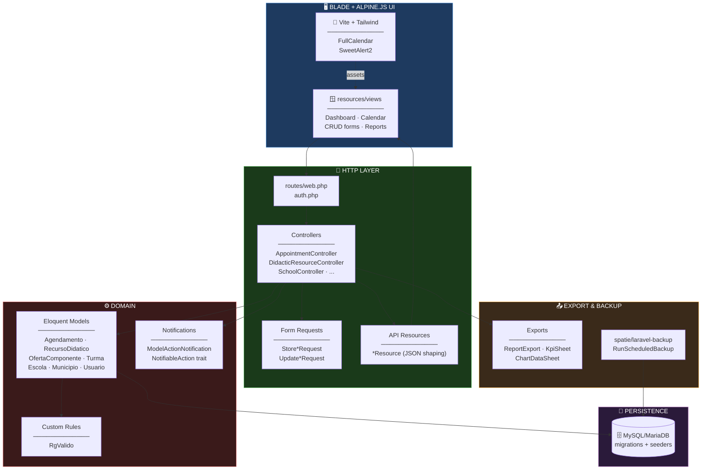
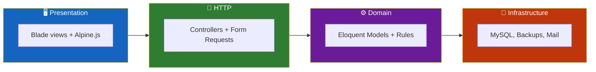
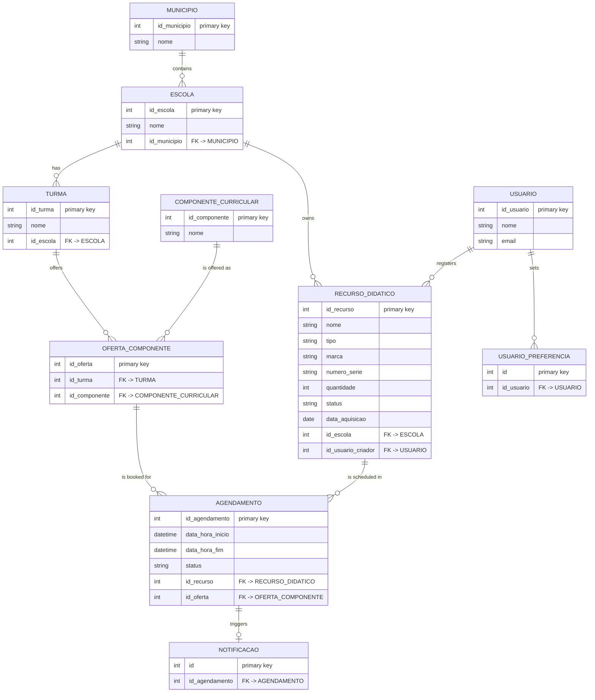
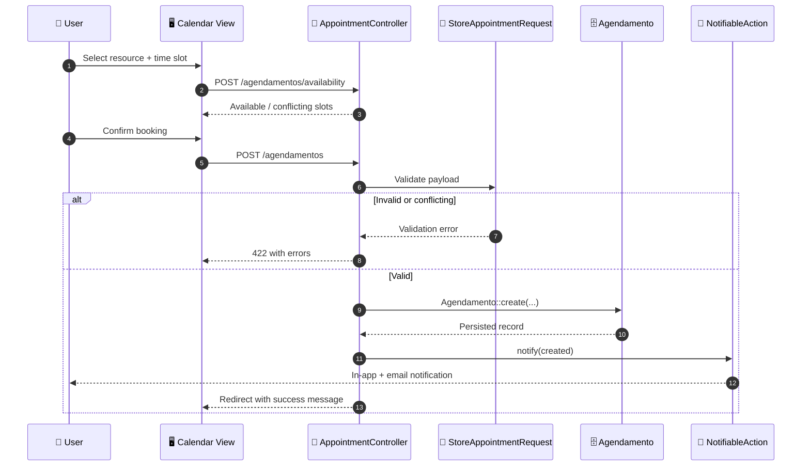
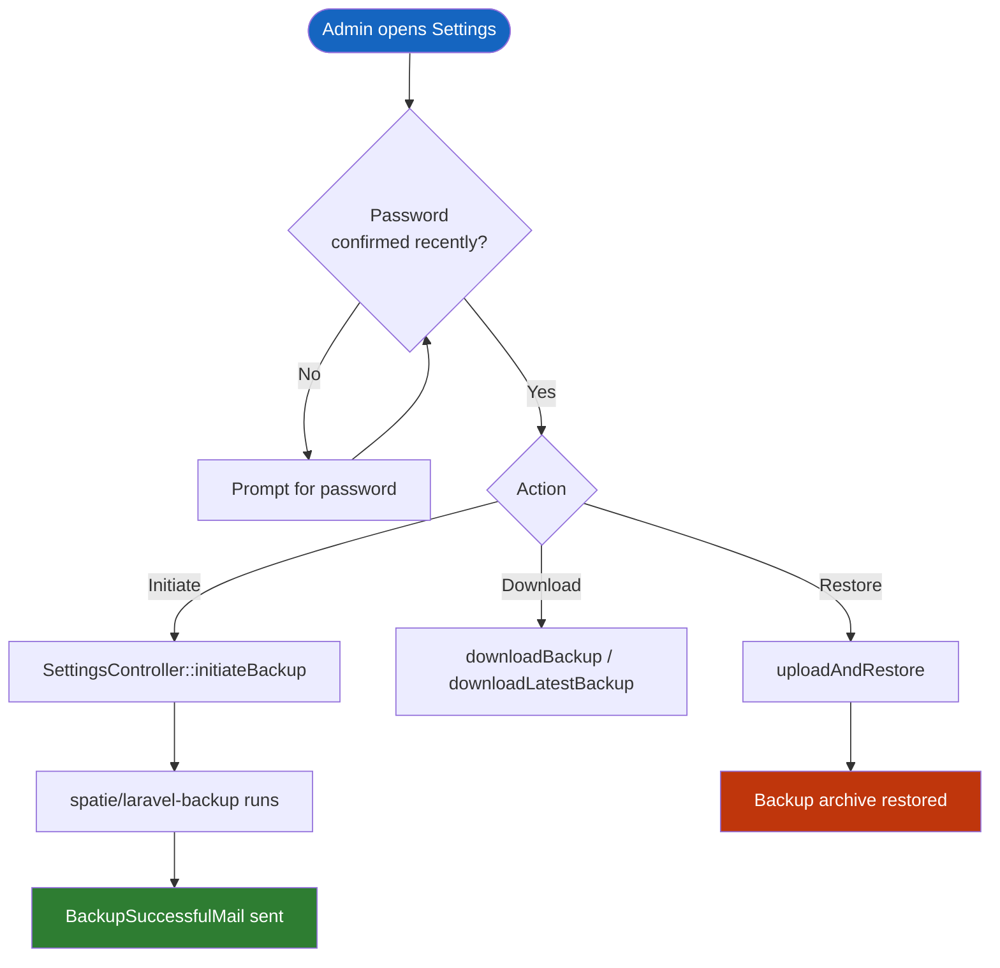
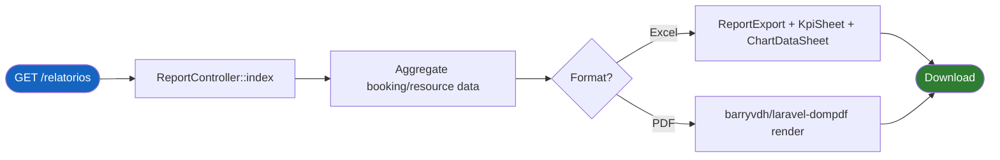
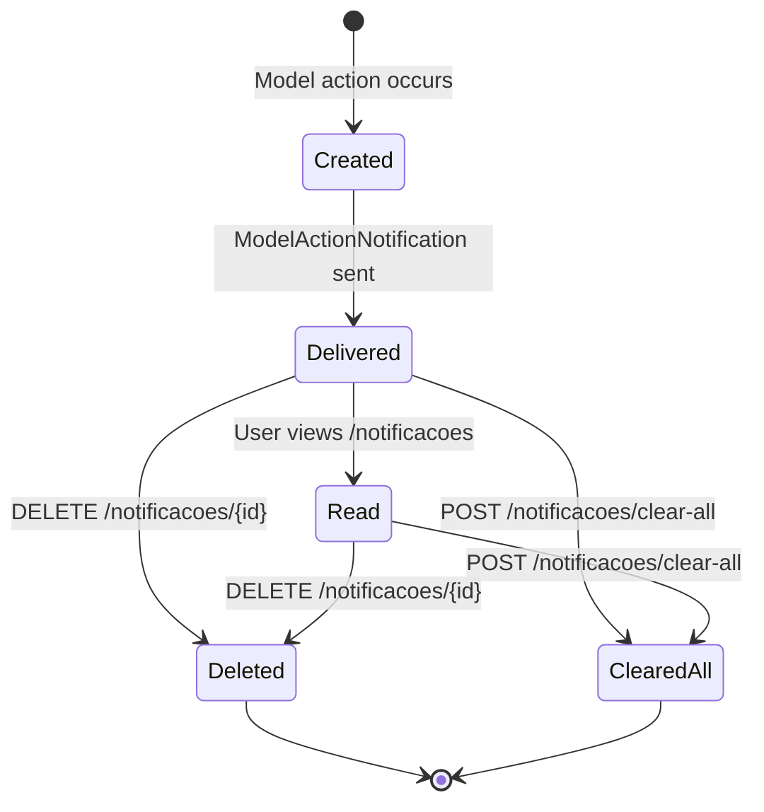
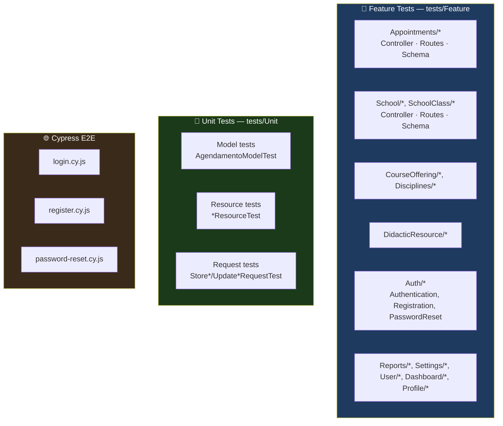

<div align="center">

**🌐 Choose Language / Selecione o Idioma / Elija el Idioma**

[](README.md)&nbsp;&nbsp;&nbsp;[](README_PT.md)&nbsp;&nbsp;&nbsp;[](README_ES.md)

</div>

---

<div align="center">

```
███╗   ██╗██████╗ ███████╗██████╗ ██╗   ██╗████████╗███████╗ ██████╗██╗  ██╗
████╗  ██║██╔══██╗██╔════╝██╔══██╗██║   ██║╚══██╔══╝██╔════╝██╔════╝██║  ██║
██╔██╗ ██║██████╔╝█████╗  ██║  ██║██║   ██║   ██║   █████╗  ██║     ███████║
██║╚██╗██║██╔══██╗██╔══╝  ██║  ██║██║   ██║   ██║   ██╔══╝  ██║     ██╔══██║
██║ ╚████║██║  ██║███████╗██████╔╝╚██████╔╝   ██║   ███████╗╚██████╗██║  ██║
╚═╝  ╚═══╝╚═╝  ╚═╝╚══════╝╚═════╝  ╚═════╝    ╚═╝   ╚══════╝ ╚═════╝╚═╝  ╚═╝
        School resource scheduling & reporting platform (Laravel 12)
```

---

[](https://www.php.net/)
[](https://laravel.com/)
[](https://vitejs.dev/)
[](https://tailwindcss.com/)
[](https://www.cypress.io/)
[](https://phpunit.de/)
[]()

<br/>

> **A Laravel platform that schedules didactic resources across a school network**
> and reports on their usage, availability and conflicts.

<br/>


</div>

---

## 📑 Table of Contents

<details>
<summary>▶️ <strong>Click to expand / collapse this section</strong></summary>

<table>
<tr>
<td valign="top" width="50%">

**🏗️ System**
- [Overview](#-overview)
- [System Architecture](#-system-architecture)
- [Technology Stack](#-technology-stack)
- [Design Patterns](#-design-patterns-applied)
- [Project Structure](#-project-structure)

**📦 Modules**
- [System Modules](#-system-modules)

</td>
<td valign="top" width="50%">

**💼 Business**
- [Business Rules](#-business-rules)
- [Functional Requirements](#-functional-requirements)
- [Non-Functional Requirements](#-non-functional-requirements)

**📐 Design**
- [Data Model](#-data-model)
- [System Flows](#-system-flows)

**🔐 Security & Ops**
- [Security](#-security)
- [Installation & Execution](#-installation--execution)
- [Automated Tests](#-automated-tests)
- [Metrics & Monitoring](#-metrics--monitoring)
- [Known Limitations](#-known-limitations)

</td>
</tr>
</table>

---

</details>

## 🌟 Overview

<details>
<summary>▶️ <strong>Click to expand / collapse this section</strong></summary>

**nredutech** is a Laravel 12 web application that manages the allocation of **didactic resources** (labs, equipment, rooms) across a network of schools belonging to municipalities (`Municipio` / `Escola`). It centers on `Agendamento` (Appointment): a booking of a `RecursoDidatico` (Didactic Resource) for a `OfertaComponente` (Course Offering), which links a `Turma` (School Class) to a `ComponenteCurricular` (Curricular Component).

The system enforces availability rules so two course offerings cannot double-book the same resource in an overlapping time window, surfaces a calendar view of bookings, sends notifications on booking events, and produces exportable reports (Excel via `maatwebsite/excel`, PDF via `barryvdh/laravel-dompdf`) with charts and KPIs. Administrators can trigger and restore encrypted backups through `spatie/laravel-backup`.

The frontend is server-rendered Blade with Tailwind CSS, Alpine.js for interactivity, FullCalendar for the scheduling calendar, and SweetAlert2 for confirmations.

### 🎯 System Objectives

| Objective | Description |
|-----------|-------------|
| 📅 **Resource booking** | Let staff schedule a didactic resource for a specific course offering and time window |
| 🚫 **Conflict prevention** | Reject or flag bookings that overlap an already-booked resource |
| 🏫 **School network management** | Model municipalities, schools, classes and curricular components |
| 🔔 **Notifications** | Notify users of booking creation, updates and cancellations |
| 📊 **Reporting** | Generate Excel/PDF reports with KPIs and charts on resource usage |
| 👤 **Role-based access** | Restrict school and municipality management to `administrador` users |
| 💾 **Backups** | Schedule, download and restore encrypted application backups |
| 🌐 **Localization** | Serve the UI and validation messages in Brazilian Portuguese by default |

---

</details>

## 🏗️ System Architecture

<details>
<summary>▶️ <strong>Click to expand / collapse this section</strong></summary>

### Module Diagram



### Architecture Layers



---

</details>

## 🛠️ Technology Stack

<details>
<summary>▶️ <strong>Click to expand / collapse this section</strong></summary>

<table>
<thead>
<tr>
<th>Layer</th>
<th>Technology</th>
<th>Version</th>
<th>Purpose</th>
</tr>
</thead>
<tbody>
<tr>
<td rowspan="2"><strong>🧠 Language / Runtime</strong></td>
<td>PHP</td>
<td>^8.3</td>
<td>Application language</td>
</tr>
<tr>
<td>Composer</td>
<td>—</td>
<td>Dependency management (<code>composer.json</code>)</td>
</tr>
<tr>
<td rowspan="3"><strong>🖥️ Backend Framework</strong></td>
<td>Laravel</td>
<td>^12.0</td>
<td>MVC framework, routing, Eloquent ORM</td>
</tr>
<tr>
<td>Laravel Breeze</td>
<td>^2.0</td>
<td>Authentication scaffolding</td>
</tr>
<tr>
<td>Laravel Tinker</td>
<td>^2.10</td>
<td>REPL for debugging/seeding</td>
</tr>
<tr>
<td rowspan="4"><strong>🎨 Frontend</strong></td>
<td>Vite</td>
<td>^7.0.4</td>
<td>Asset bundling</td>
</tr>
<tr>
<td>Tailwind CSS</td>
<td>^3.1.0</td>
<td>Utility-first styling</td>
</tr>
<tr>
<td>Alpine.js</td>
<td>^3.4.2</td>
<td>Lightweight in-page interactivity</td>
</tr>
<tr>
<td>FullCalendar (core, daygrid, timegrid, list, interaction, resource-timeline)</td>
<td>^6.1.19</td>
<td>Appointment calendar UI</td>
</tr>
<tr>
<td rowspan="4"><strong>📦 App Packages</strong></td>
<td>maatwebsite/excel</td>
<td>^3.1</td>
<td>Excel report generation (KPI + chart sheets)</td>
</tr>
<tr>
<td>barryvdh/laravel-dompdf</td>
<td>^3.0.0-beta2</td>
<td>PDF report generation</td>
</tr>
<tr>
<td>spatie/laravel-backup</td>
<td>^9.3</td>
<td>Scheduled/on-demand encrypted backups</td>
</tr>
<tr>
<td>laravel-lang/lang + laravellegends/pt-br-validator</td>
<td>^15.0 / dev-master</td>
<td>Brazilian Portuguese translations and validation messages</td>
</tr>
<tr>
<td rowspan="3"><strong>🧪 Testing</strong></td>
<td>PHPUnit</td>
<td>^11.0</td>
<td>Feature and unit test runner</td>
</tr>
<tr>
<td>Mockery</td>
<td>^1.6</td>
<td>Test doubles</td>
</tr>
<tr>
<td>Cypress</td>
<td>^15.6.0</td>
<td>End-to-end browser tests (auth flows)</td>
</tr>
<tr>
<td rowspan="2"><strong>🔧 Dev Tooling</strong></td>
<td>Laravel Pint</td>
<td>^1.13</td>
<td>Code style fixer (PSR-12)</td>
</tr>
<tr>
<td>Laravel Sail / Pail</td>
<td>^1.26 / ^1.2</td>
<td>Docker dev environment / log tailing</td>
</tr>
</tbody>
</table>

---

</details>

## 🎨 Design Patterns Applied

<details>
<summary>▶️ <strong>Click to expand / collapse this section</strong></summary>

| Pattern | Where | Rationale |
|---------|-------|-----------|
| 🧱 **MVC** | `app/Http/Controllers`, `app/Models`, `resources/views` | Standard Laravel separation of concerns |
| 📝 **Form Request Validation** | `app/Http/Requests/Store*Request.php`, `Update*Request.php` | Validation and authorization live outside the controller body |
| 🎁 **Resource / DTO** | `app/Http/Resources/*Resource.php` | Shapes Eloquent models into consistent JSON for calendar/API consumers |
| 🧩 **Trait Composition** | `app/Traits/NotifiableAction.php` | Shared notification-dispatch behavior mixed into multiple controllers |
| 🔌 **Active Record** | Eloquent models (`Agendamento`, `RecursoDidatico`, ...) | Each model owns its own relationships and table mapping |
| 🧪 **Custom Validation Rule** | `app/Rules/RgValido.php` | Domain-specific document validation (Brazilian RG) encapsulated as a rule object |
| 📤 **Exporter Strategy** | `app/Exports/*.php` (`ReportExport`, `KpiSheet`, `ChartDataSheet`) | Each export concern implemented as its own `maatwebsite/excel` sheet class |
| ⏰ **Scheduled Command** | `app/Console/Commands/RunScheduledBackup.php` | Backup logic isolated behind an Artisan command, wired into the scheduler |
| 🔔 **Observer-like Notification** | `app/Notifications/ModelActionNotification.php` | Generic notification fired after model create/update/delete actions |

---

</details>

## 📁 Project Structure

<details>
<summary>▶️ <strong>Click to expand / collapse this section</strong></summary>

```
nredutech/
│
├── 📄 composer.json                     # PHP dependencies (Laravel 12, PHP ^8.3)
├── 📄 package.json                      # JS dependencies (Vite, Tailwind, FullCalendar)
├── 📄 phpunit.xml                       # PHPUnit suite configuration
├── 📄 vite.config.js                    # Vite build configuration
├── 📄 tailwind.config.js                # Tailwind theme configuration
├── 📄 cypress.config.js                 # Cypress E2E configuration
├── 📄 artisan                           # Laravel CLI entry point
│
├── 📂 app/
│   ├── 📂 Console/Commands/             # RunScheduledBackup.php
│   ├── 📂 Exports/                      # ReportExport, KpiSheet, ChartDataSheet, AllReportsExport
│   ├── 📂 Http/
│   │   ├── 📂 Controllers/              # 14 controllers (Appointment, School, User, Report, ...)
│   │   ├── 📂 Requests/                 # Store*/Update* form request classes
│   │   └── 📂 Resources/                # *Resource.php JSON transformers
│   ├── 📂 Mail/                         # BackupSuccessfulMail, CustomResetPasswordMail, NotificationMail
│   ├── 📂 Models/                       # Agendamento, RecursoDidatico, Escola, Municipio, ...
│   ├── 📂 Notifications/                # ModelActionNotification, CustomBackupWasSuccessfulNotification
│   ├── 📂 Providers/                    # App/Auth/Event/Route service providers
│   ├── 📂 Rules/                        # RgValido.php
│   ├── 📂 Traits/                       # NotifiableAction.php
│   └── 📂 View/Components/              # AppLayout, GuestLayout
│
├── 📂 database/
│   ├── 📂 migrations/                   # Schema history (Portuguese table/column names)
│   ├── 📂 factories/                    # Model factories for tests/seeding
│   └── 📂 seeders/                      # Reference/demo data seeders
│
├── 📂 routes/
│   ├── web.php                          # Authenticated app routes (resource controllers)
│   └── auth.php                         # Breeze authentication routes
│
├── 📂 resources/
│   ├── 📂 views/                        # Blade templates (dashboard, CRUD, calendar, reports)
│   ├── 📂 css/ · 📂 js/                 # Tailwind entry + Alpine/FullCalendar wiring
│   └── 📂 lang/                         # pt_BR translation strings
│
├── 📂 tests/
│   ├── 📂 Feature/                      # Controller/route/schema tests per module
│   └── 📂 Unit/                         # Model, Request and Resource unit tests
│
├── 📂 cypress/
│   └── 📂 e2e/                          # login.cy.js, register.cy.js, password-reset.cy.js
│
├── 📄 README.md                         # 🇺🇸 English (primary)
├── 📄 README_PT.md                      # 🇧🇷 Português
└── 📄 README_ES.md                      # 🇪🇸 Español
```

---

</details>

## 📦 System Modules

<details>
<summary>▶️ <strong>Click to expand / collapse this section</strong></summary>

### 📅 Appointment Scheduling (`Agendamento`)

`AppointmentController` is the core of the system: it lists a FullCalendar-ready feed (`getCalendarEvents`), checks free slots for a resource on a given date (`getAvailabilityForDate`) and exposes the standard `Route::resource('agendamentos', ...)` CRUD.

| Responsibility | Implementation |
|-----------------|-----------------|
| Calendar feed | `GET /agendamentos/events` → `AppointmentController::getCalendarEvents` |
| Availability check | `POST /agendamentos/availability` → `getAvailabilityForDate` |
| CRUD | `Route::resource('agendamentos', AppointmentController::class)` |
| Validation | `StoreAppointmentRequest`, `UpdateAppointmentRequest` |
| JSON shaping | `AppointmentResource` |
| Model fields | `data_hora_inicio`, `data_hora_fim`, `status`, `id_recurso`, `id_oferta` |
| Relations | `belongsTo RecursoDidatico`, `belongsTo OfertaComponente`, `hasOne Notificacao` |

---

### 🧰 Didactic Resources (`RecursoDidatico`)

Represents a bookable asset (lab equipment, projector, room, etc.) owned by a school.

| Field | Purpose |
|-------|---------|
| `nome`, `tipo`, `marca`, `numero_serie` | Identification and inventory data |
| `quantidade` | Units available |
| `status` | Current availability/condition state |
| `data_aquisicao` | Acquisition date |
| `id_escola` | Owning school (`belongsTo Escola`) |
| `id_usuario_criador` | Creator (`belongsTo Usuario`) |
| `agendamentos()` | `hasMany Agendamento` — full booking history |

---

### 🏫 School Network (`Escola`, `Municipio`, `Turma`)

Models the organizational hierarchy: a `Municipio` (City) contains `Escola` (Schools), each with `Turma` (Classes). Management of `escolas` and `municipios` is restricted to `administrador` users via `Route::middleware(['can:administrador'])`.

| Controller | Route prefix | Access |
|------------|--------------|--------|
| `SchoolController` | `/escolas` | `can:administrador` only |
| `CityController` | `/municipios` | `can:administrador` only |
| `SchoolClassController` | `/turmas` | Any authenticated user |

---

### 📚 Curriculum (`ComponenteCurricular`, `OfertaComponente`)

`ComponenteCurricular` (Curricular Component, e.g. a subject) is offered in a specific `Turma` through `OfertaComponente` (Course Offering) — the entity an `Agendamento` actually books time against.

| Controller | Route prefix | Route parameter alias |
|------------|--------------|------------------------|
| `CurricularComponentController` | `/componentes` | `componente` |
| `CourseOfferingController` | `/ofertas` | `ofertaComponente` |

---

### 👤 Users & Profile

| Controller | Responsibility |
|------------|-----------------|
| `UserController` | Admin-facing CRUD over `Usuario` |
| `ProfileController` | Self-service profile edit/delete for the logged-in user |
| `UserPreferenceController` | Persists per-user UI preferences (`UsuarioPreferencia`) |

---

### 🔔 Notifications

| File | Responsibility |
|------|-----------------|
| `NotificationController` | Lists, deletes and bulk-clears in-app notifications |
| `app/Notifications/ModelActionNotification.php` | Generic "an action happened on a model" notification |
| `app/Traits/NotifiableAction.php` | Mixed into controllers to dispatch notifications after create/update/delete |
| `app/Mail/NotificationMail.php` | Email transport for notifications |

---

### 📊 Reports & Exports

| File | Responsibility |
|------|-----------------|
| `ReportController` | Serves `/relatorios` and builds report data |
| `app/Exports/ReportExport.php`, `SingleReportSheet.php`, `AllReportsExport.php` | Excel workbook composition (`maatwebsite/excel`) |
| `app/Exports/KpiSheet.php`, `ChartDataSheet.php` | KPI and chart data sheets embedded in the exported workbook |
| PDF path | `barryvdh/laravel-dompdf` renders the same report data as PDF |

---

### 💾 Settings & Backup

| Route | Access | Responsibility |
|-------|--------|-----------------|
| `PATCH /configuracoes/preferences` | Any user | Update UI preferences |
| `PATCH /configuracoes/backup/schedule` | `administrador` | Update the backup schedule |
| `GET /configuracoes/backup/initiate` | `administrador` + `password.confirm` | Trigger an on-demand backup |
| `GET /configuracoes/backup/download/{filename}` | `administrador` + `password.confirm` | Download a specific backup archive |
| `POST /configuracoes/backup/restore-upload` | `administrador` + `password.confirm` | Upload and restore a backup |
| `app/Console/Commands/RunScheduledBackup.php` | Scheduler | Runs `spatie/laravel-backup` on a schedule |

---

</details>

## 💼 Business Rules

<details>
<summary>▶️ <strong>Click to expand / collapse this section</strong></summary>

### 📅 Scheduling Rules

| # | Rule | Enforcement |
|---|------|-------------|
| BR-01 | A resource cannot be double-booked in an overlapping time window | Availability check in `AppointmentController::getAvailabilityForDate` / validated on store |
| BR-02 | An appointment must reference an existing resource and course offering | Foreign keys `id_recurso`, `id_oferta` + `StoreAppointmentRequest` validation |
| BR-03 | An appointment carries a `status` reflecting its lifecycle | `status` column on `agendamentos`, covered by `AppointmentDatabaseSchemaTest` |

### 🏫 Organizational Rules

| # | Rule | Enforcement |
|---|------|-------------|
| BR-04 | Only `administrador` users may manage schools and municipalities | `Route::middleware(['can:administrador'])` around `escolas` / `municipios` |
| BR-05 | Sensitive backup operations require password re-confirmation | `Route::middleware(['password.confirm'])` on initiate/download/restore |
| BR-06 | A didactic resource belongs to exactly one school | `id_escola` foreign key on `recursos_didaticos`, not nullable |

### 🔔 Notification Rules

| # | Rule | Enforcement |
|---|------|-------------|
| BR-07 | Notable model actions generate an in-app notification | `NotifiableAction` trait invoked from controllers |
| BR-08 | Users can clear all their notifications at once | `POST /notificacoes/clear-all` → `NotificationController::clearAll` |

---

</details>

## ✅ Functional Requirements

<details>
<summary>▶️ <strong>Click to expand / collapse this section</strong></summary>

| ID | Requirement | Priority | Status |
|----|-------------|----------|--------|
| **RF-01** | The system shall allow authenticated users to register and log in | 🔴 High | ✅ Implemented |
| **RF-02** | The system shall present a dashboard summarizing key activity | 🔴 High | ✅ Implemented |
| **RF-03** | The system shall let users create, view, update and delete appointments | 🔴 High | ✅ Implemented |
| **RF-04** | The system shall expose appointments as a FullCalendar-compatible feed | 🔴 High | ✅ Implemented |
| **RF-05** | The system shall check resource availability before confirming a booking | 🔴 High | ✅ Implemented |
| **RF-06** | The system shall manage didactic resources with inventory metadata | 🔴 High | ✅ Implemented |
| **RF-07** | The system shall manage curricular components and course offerings | 🟡 Medium | ✅ Implemented |
| **RF-08** | The system shall manage school classes (`turmas`) | 🟡 Medium | ✅ Implemented |
| **RF-09** | The system shall restrict school and municipality management to administrators | 🔴 High | ✅ Implemented |
| **RF-10** | The system shall manage application users | 🟡 Medium | ✅ Implemented |
| **RF-11** | The system shall let a user edit or delete their own profile | 🟡 Medium | ✅ Implemented |
| **RF-12** | The system shall persist per-user preferences | 🟢 Low | ✅ Implemented |
| **RF-13** | The system shall list and let users manage notifications | 🟡 Medium | ✅ Implemented |
| **RF-14** | The system shall generate Excel reports with KPIs and charts | 🟡 Medium | ✅ Implemented |
| **RF-15** | The system shall generate PDF reports | 🟡 Medium | ✅ Implemented |
| **RF-16** | The system shall allow administrators to schedule automatic backups | 🟡 Medium | ✅ Implemented |
| **RF-17** | The system shall allow administrators to download and restore backups | 🟡 Medium | ✅ Implemented |
| **RF-18** | The system shall require password re-confirmation for sensitive backup actions | 🔴 High | ✅ Implemented |
| **RF-19** | The system shall validate Brazilian document numbers (RG) via a custom rule | 🟢 Low | ✅ Implemented |
| **RF-20** | The system shall serve the UI in Brazilian Portuguese | 🟡 Medium | ✅ Implemented |
| **RF-21** | The system shall send email notifications for relevant events | 🟢 Low | ✅ Implemented |
| **RF-22** | The system shall cover authentication flows with end-to-end Cypress tests | 🟡 Medium | ✅ Implemented |

---

</details>

## ⚡ Non-Functional Requirements

<details>
<summary>▶️ <strong>Click to expand / collapse this section</strong></summary>

| ID | Category | Requirement | Target |
|----|----------|-------------|--------|
| **RNF-01** | 🔐 Security | CSRF protection on all state-changing requests | `VerifyCsrfToken` middleware |
| **RNF-02** | 🔐 Security | Passwords hashed by Laravel's default hasher | Laravel `Hash` facade (bcrypt) |
| **RNF-03** | 🔐 Access Control | Admin-only routes gated by a Laravel Gate/Policy | `can:administrador` middleware |
| **RNF-04** | 🔐 Security | Backup downloads/restores require a recent password confirmation | `password.confirm` middleware |
| **RNF-05** | 🧪 Testability | Every major module has controller, route and schema tests | `tests/Feature/<Module>/*Test.php` |
| **RNF-06** | 🧪 Testability | Critical auth flows covered end-to-end | `cypress/e2e/*.cy.js` |
| **RNF-07** | 🌍 Localization | UI and validation messages default to pt-BR | `laravel-lang/lang`, `pt-br-validator` |
| **RNF-08** | 🧱 Maintainability | Code style enforced automatically | Laravel Pint (PSR-12) |
| **RNF-09** | 💾 Reliability | Application state recoverable via backups | `spatie/laravel-backup` |
| **RNF-10** | 📈 Observability | Backup outcomes reported by email | `BackupSuccessfulMail`, `CustomBackupWasSuccessfulNotification` |
| **RNF-11** | ⚡ Performance | Frontend assets bundled and minified for production | `vite build` |
| **RNF-12** | 📱 Usability | Calendar view supports day/week/list/resource-timeline layouts | FullCalendar plugin set in `package.json` |
| **RNF-13** | 🔧 Portability | Dockerized local environment available | Laravel Sail dev dependency |

---

</details>

## 🗄️ Data Model

<details>
<summary>▶️ <strong>Click to expand / collapse this section</strong></summary>

### Entity-Relationship Diagram



### Key Table Columns

| Table | Primary Key | Notable Columns |
|-------|-------------|------------------|
| `agendamentos` | `id_agendamento` | `data_hora_inicio`, `data_hora_fim`, `status`, `id_recurso`, `id_oferta` |
| `recursos_didaticos` | `id_recurso` | `nome`, `tipo`, `marca`, `numero_serie`, `quantidade`, `status`, `data_aquisicao`, `id_escola`, `id_usuario_criador` |
| `escolas` | `id_escola` | `nome`, `id_municipio` |
| `municipios` | `id_municipio` | `nome` |

### Migration & Seeding

| Concern | File(s) |
|---------|---------|
| Schema history | `database/migrations/*.php` |
| Reference/demo data | `database/seeders/*.php` |
| Test data generation | `database/factories/*.php` |

---

</details>

## 🔄 System Flows

<details>
<summary>▶️ <strong>Click to expand / collapse this section</strong></summary>

### Appointment Creation Flow



### Backup & Restore Flow



### Report Generation Flow



### Notification Lifecycle



---

</details>

## 🔐 Security

<details>
<summary>▶️ <strong>Click to expand / collapse this section</strong></summary>

### Implemented Controls

| Control | Implementation | Effect |
|---------|---------------|--------|
| 🔐 **Authentication** | Laravel Breeze (`auth.php` routes) | Session-based login, registration, password reset |
| 🛡️ **CSRF protection** | `VerifyCsrfToken` middleware | Rejects state-changing requests without a valid token |
| 🔑 **Password re-confirmation** | `password.confirm` middleware on backup routes | High-impact actions require a recent password check |
| 🚦 **Role gating** | `can:administrador` middleware | Only administrators reach school/municipality/backup management |
| 🧾 **Server-side validation** | `Store*Request` / `Update*Request` classes | Every write path validates before touching the database |
| 🧬 **Custom document validation** | `app/Rules/RgValido.php` | Rejects malformed Brazilian RG numbers |
| 💾 **Encrypted backups** | `spatie/laravel-backup` | Application state can be recovered without exposing plaintext archives if encryption is configured |
| 📧 **Password reset via signed mail** | `CustomResetPasswordMail` | Reset links are time-limited and signed |

### Known Security Limitations

> [!WARNING]
> The following are inherent to the current design and should be understood before broader production use.

| Limitation | Risk | Mitigation path |
|------------|------|-----------------|
| 🗄️ **Primary keys use Portuguese, table-specific names** (`id_agendamento`, `id_recurso`) | Increases coupling between raw SQL/reports and schema naming | Acceptable for a single-team codebase; document if the schema is exposed externally |
| 🔓 **No visible rate limiting on auth routes in `web.php`** | Brute-force risk on login/registration | Add Laravel's built-in `throttle` middleware to `auth.php` routes if not already inherited from Breeze defaults |
| 📤 **Report exports may include personally identifiable data** | Excel/PDF reports could leak student/staff data if shared broadly | Restrict report access to `administrador` and audit `ReportController::index` authorization |
| 🔁 **Backup restore accepts an uploaded file** | A malicious archive could be uploaded by a compromised admin account | Combine with strong admin account hygiene (2FA is not currently implemented) |
| 🌍 **No 2FA** | Account takeover risk if a password leaks | Add Laravel Fortify or similar two-factor support |

---

</details>

## 🚀 Installation & Execution

<details>
<summary>▶️ <strong>Click to expand / collapse this section</strong></summary>

### Prerequisites

```bash
# PHP 8.3+ with common extensions (pdo_mysql, mbstring, xml, ...)
php -v

# Composer
composer -V

# Node.js 18+ and npm
node -v

# A MySQL/MariaDB database (or Laravel Sail's bundled container)
```

### Build

```bash
# Install PHP dependencies
composer install

# Install JS dependencies
npm install

# Copy environment file and generate the app key
cp .env.example .env
php artisan key:generate

# Configure DB_* variables in .env, then run migrations + seeders
php artisan migrate --seed

# Build frontend assets for production
npm run build
```

### Execution

```bash
# Local development (Laravel dev server)
php artisan serve

# Local development (Vite dev server with HMR, in a second terminal)
npm run dev

# Or, with Laravel Sail (Docker)
./vendor/bin/sail up -d
./vendor/bin/sail artisan migrate --seed
```

### Scripts & Targets

| Command | Purpose |
|---------|---------|
| `php artisan serve` | Run the built-in PHP dev server |
| `npm run dev` | Start the Vite dev server with hot module reload |
| `npm run build` | Build production frontend assets |
| `php artisan migrate --seed` | Apply migrations and seed reference data |
| `php artisan backup:run` | Trigger a `spatie/laravel-backup` backup manually |
| `php artisan schedule:run` | Run due scheduled commands (e.g. `RunScheduledBackup`) |
| `./vendor/bin/pint` | Apply Laravel Pint code style fixes |

### Environment Configuration

| Variable group | Purpose |
|-----------------|---------|
| `APP_*` | App name, environment, debug mode, key |
| `DB_*` | Database connection (MySQL/MariaDB) |
| `MAIL_*` | SMTP settings for notification and backup emails |
| `BACKUP_*` | Backup destination and encryption settings for `spatie/laravel-backup` |

---

</details>

## 🧪 Automated Tests

<details>
<summary>▶️ <strong>Click to expand / collapse this section</strong></summary>

### Test Architecture



| Suite | Location | Focus |
|-------|----------|-------|
| Appointments | `tests/Feature/Appointments/` | Controller, routes, DB schema for `agendamentos` |
| School network | `tests/Feature/School/`, `tests/Feature/SchoolClass/` | Schools, cities, classes |
| Curriculum | `tests/Feature/CourseOffering/`, `tests/Feature/Disciplines/` | Course offerings, curricular components |
| Didactic resources | `tests/Feature/DidacticResource/` | Controller, routes, schema |
| Auth | `tests/Feature/Auth/` | Authentication, registration, password reset |
| Users & profile | `tests/Feature/User/`, `tests/Feature/Profile/` | User CRUD, notifications, profile self-service |
| Reports & settings | `tests/Feature/Reports/`, `tests/Feature/Settings/`, `tests/Feature/Dashboard/` | Report generation and settings/backup routes |
| Unit | `tests/Unit/` | Model, Resource and Request classes in isolation |
| E2E | `cypress/e2e/` | Login, registration, password reset happy paths in a real browser |

### Running the Tests

```bash
# PHPUnit feature + unit suite
php artisan test
# or
./vendor/bin/phpunit

# Cypress E2E (requires the app running, e.g. via `php artisan serve`)
npx cypress open      # interactive
npx cypress run       # headless
```

### Manual Acceptance Checklist

| # | Scenario | Expected result |
|---|----------|-----------------|
| 1 | Register and log in | Account created, redirected to dashboard |
| 2 | Book a resource for an available slot | Appointment created, calendar updated |
| 3 | Attempt to book an already-booked slot | Booking rejected with a conflict message |
| 4 | Non-admin visits `/escolas` | Access denied (403) |
| 5 | Admin creates a school and a municipality | Records created and listed |
| 6 | Generate an Excel report | File downloads with KPI and chart sheets |
| 7 | Generate a PDF report | PDF downloads with the same underlying data |
| 8 | Trigger a manual backup as admin | Backup created, confirmation email sent |
| 9 | Clear all notifications | Notification list empties |

---

</details>

## 📊 Metrics & Monitoring

<details>
<summary>▶️ <strong>Click to expand / collapse this section</strong></summary>

### Codebase Metrics

| Metric | Value |
|--------|-------|
| Controllers | 14 |
| Eloquent models | 9 |
| Form Request classes | 20 |
| API Resource classes | 8 |
| Export classes | 5 |
| Feature test directories | 10 modules |
| Unit test files | 10+ (models, resources, requests) |
| Cypress E2E specs | 3 |
| Notification classes | 2 |

### Runtime Signals

| Signal | Source | Where to observe |
|--------|--------|------------------|
| Backup success/failure | `spatie/laravel-backup` events | `BackupSuccessfulMail`, `CustomBackupWasSuccessfulNotification` |
| Scheduled job runs | Laravel scheduler | `php artisan schedule:list`, log output |
| Application errors | Laravel exception handler | `storage/logs/laravel.log` |
| Request-level logs | `php artisan pail` | Real-time log tailing in development |

### Useful Diagnostic Commands

```bash
# Tail application logs live
php artisan pail

# List scheduled commands and their next run time
php artisan schedule:list

# Check current backup status/destinations
php artisan backup:list

# Clear cached config/routes/views after a deploy
php artisan optimize:clear
```

### Standardized Response Codes

| Code | Meaning | Where |
|------|---------|-------|
| `200` | OK | Successful GET requests |
| `302` | Redirect | Post-create/update redirects with flash messages |
| `403` | Forbidden | `can:administrador` gate rejection |
| `404` | Not Found | Missing resource route-model binding |
| `422` | Unprocessable Entity | Form Request validation failure |
| `500` | Internal Server Error | Uncaught exception, logged to `laravel.log` |

---

</details>

## ⚠️ Known Limitations

<details>
<summary>▶️ <strong>Click to expand / collapse this section</strong></summary>

> [!IMPORTANT]
> This project was built for a real school-network scheduling use case; some polish items below are known and tracked rather than accidental gaps.

| Category | Issue | Status |
|----------|-------|--------|
| 🌍 **Database naming is Portuguese** | Table/column names (`agendamentos`, `id_recurso`) mix with English class names | ➕ Intentional — matches the domain's native language |
| 🔐 **No two-factor authentication** | Single-factor login only | ⚠️ Open — consider Laravel Fortify 2FA |
| 🚦 **No visible explicit rate limiting on auth routes** | Potential brute-force exposure | ⚠️ Open — add `throttle` middleware explicitly if not covered by Breeze defaults |
| 📊 **Report performance not benchmarked** | Large datasets could slow Excel/PDF generation | ⚠️ Open — add queued export generation for large report ranges |
| 🧪 **Dusk test case present but browser tests not confirmed wired to CI** | `tests/DuskTestCase.php` exists alongside Cypress | ⚠️ Open — confirm which E2E tool is the source of truth going forward |
| 🔁 **Availability check and store validation could diverge** | Two code paths (`getAvailabilityForDate` and store validation) must agree on conflict rules | ⚠️ Open — consolidate into a single service method |
| 📧 **Mail delivery depends on correctly configured SMTP** | Misconfiguration silently drops notification/backup emails | ⚠️ Open — add a mail delivery health check |
| 💾 **Backup encryption depends on `.env` configuration** | An unencrypted backup could be created if `BACKUP_*` is misconfigured | ⚠️ Open — validate backup config on `RunScheduledBackup` startup |

> [!TIP]
> The single highest-value improvement is consolidating **availability checking and appointment validation** into one service class, removing the risk of the calendar's "available" view drifting from what the store endpoint actually accepts.

</details>

---

<div align="center">

---

### 🏫 nredutech

*One resource, one time slot, no double-booking*


<br/>

```
"A school calendar is a promise to every classroom —
 the system's only job is to keep that promise conflict-free."
```

</div>
