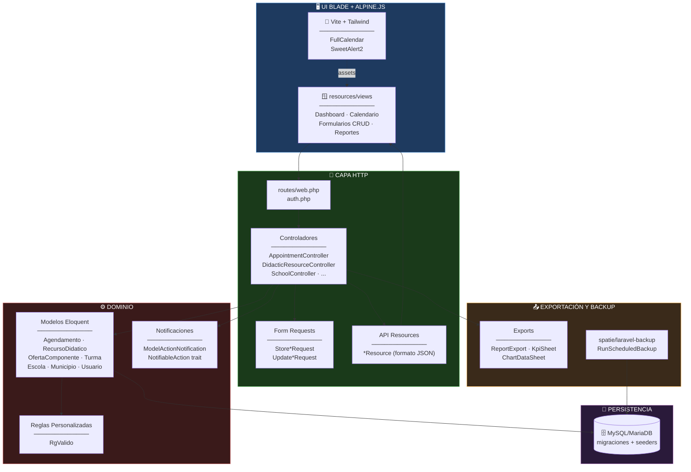
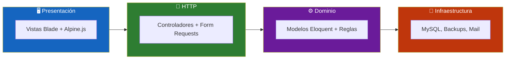
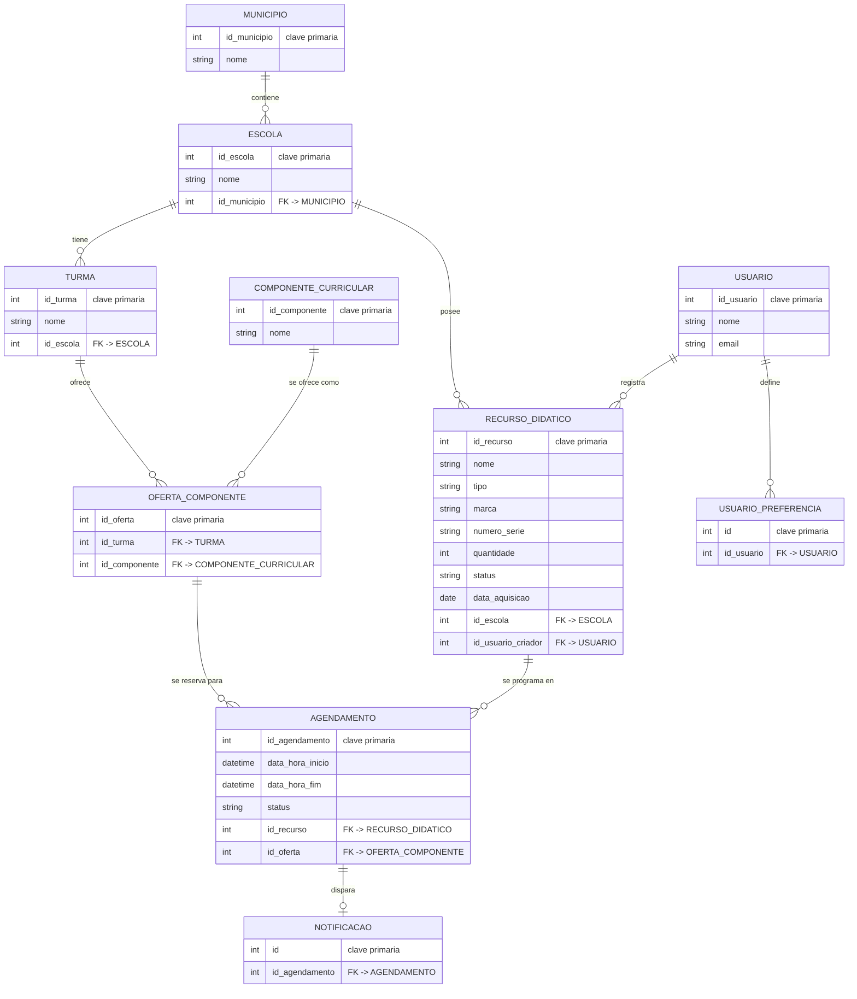
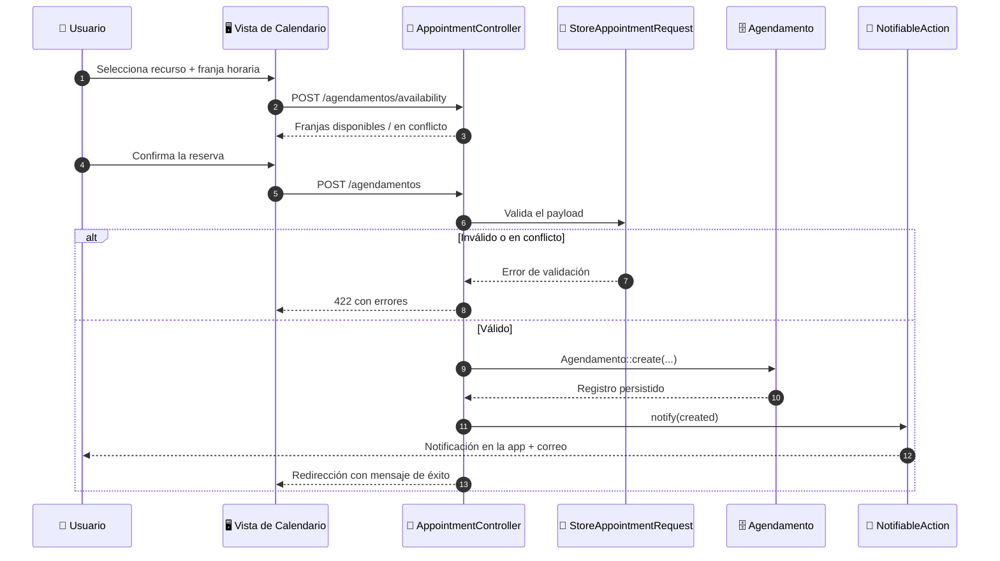
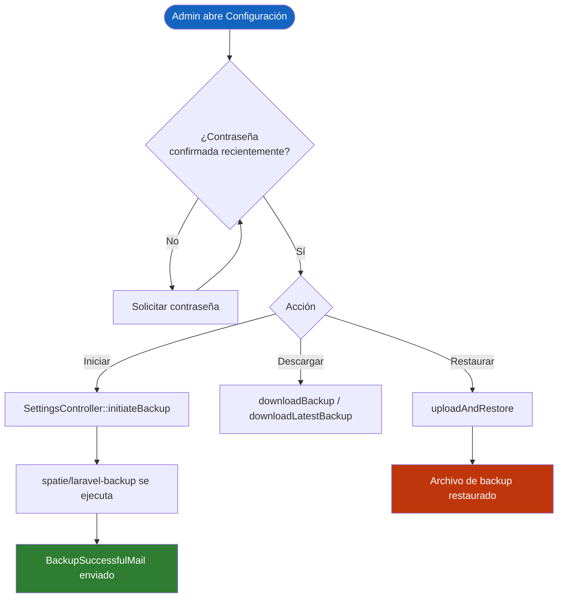
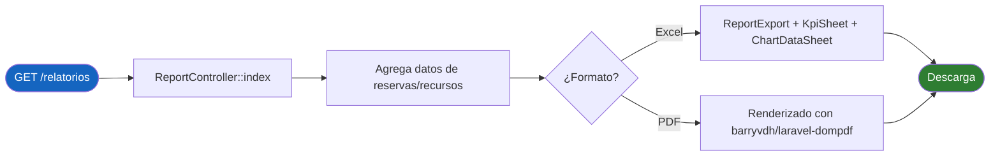
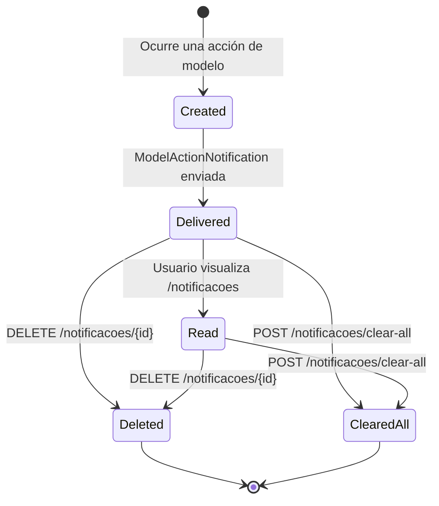
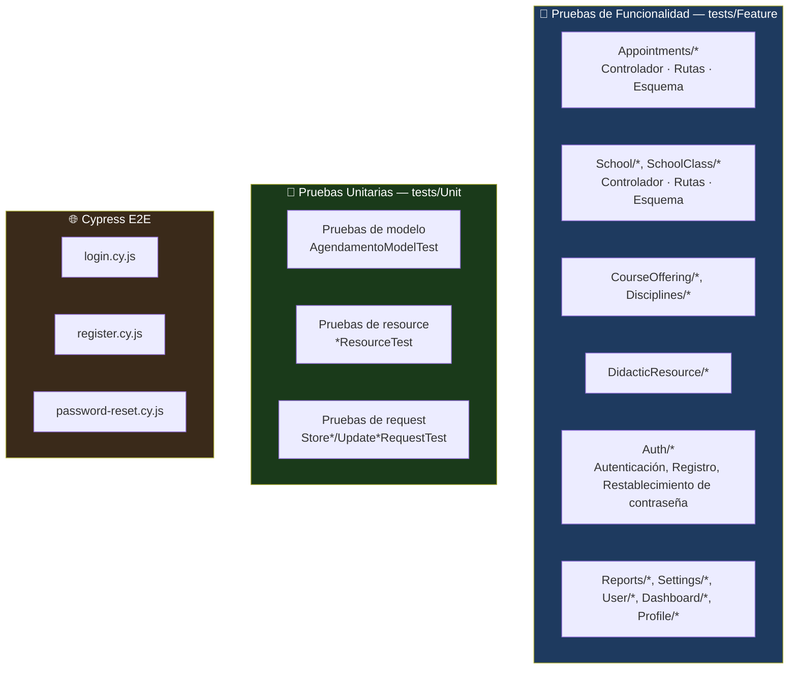

<div align="center">

**🌐 Choose Language / Selecione o Idioma / Elija el Idioma**

[](README.md)&nbsp;&nbsp;&nbsp;[](README_PT.md)&nbsp;&nbsp;&nbsp;[](README_ES.md)

</div>

---

<div align="center">

```
███╗   ██╗██████╗ ███████╗██████╗ ██╗   ██╗████████╗███████╗ ██████╗██╗  ██╗
████╗  ██║██╔══██╗██╔════╝██╔══██╗██║   ██║╚══██╔══╝██╔════╝██╔════╝██║  ██║
██╔██╗ ██║██████╔╝█████╗  ██║  ██║██║   ██║   ██║   █████╗  ██║     ███████║
██║╚██╗██║██╔══██╗██╔══╝  ██║  ██║██║   ██║   ██║   ██╔══╝  ██║     ██╔══██║
██║ ╚████║██║  ██║███████╗██████╔╝╚██████╔╝   ██║   ███████╗╚██████╗██║  ██║
╚═╝  ╚═══╝╚═╝  ╚═╝╚══════╝╚═════╝  ╚═════╝    ╚═╝   ╚══════╝ ╚═════╝╚═╝  ╚═╝
        Plataforma de programación y reportes de recursos escolares (Laravel 12)
```

---

[](https://www.php.net/)
[](https://laravel.com/)
[](https://vitejs.dev/)
[](https://tailwindcss.com/)
[](https://www.cypress.io/)
[](https://phpunit.de/)
[]()

<br/>

> **Una plataforma Laravel que programa recursos didácticos en una red de escuelas**
> y reporta su uso, disponibilidad y conflictos.

<br/>


</div>

---

## 📑 Tabla de Contenidos

<details>
<summary>▶️ <strong>Haga clic para expandir / contraer esta sección</strong></summary>

<table>
<tr>
<td valign="top" width="50%">

**🏗️ Sistema**
- [Visión General](#-visión-general)
- [Arquitectura del Sistema](#-arquitectura-del-sistema)
- [Stack Tecnológico](#-stack-tecnológico)
- [Patrones de Diseño](#-patrones-de-diseño-aplicados)
- [Estructura del Proyecto](#-estructura-del-proyecto)

**📦 Módulos**
- [Módulos del Sistema](#-módulos-del-sistema)

</td>
<td valign="top" width="50%">

**💼 Negocio**
- [Reglas de Negocio](#-reglas-de-negocio)
- [Requisitos Funcionales](#-requisitos-funcionales)
- [Requisitos No Funcionales](#-requisitos-no-funcionales)

**📐 Diseño**
- [Modelo de Datos](#-modelo-de-datos)
- [Flujos del Sistema](#-flujos-del-sistema)

**🔐 Seguridad y Operaciones**
- [Seguridad](#-seguridad)
- [Instalación & Ejecución](#-instalación--ejecución)
- [Pruebas Automatizadas](#-pruebas-automatizadas)
- [Métricas & Monitoreo](#-métricas--monitoreo)
- [Limitaciones Conocidas](#-limitaciones-conocidas)

</td>
</tr>
</table>

---

</details>

## 🌟 Visión General

<details>
<summary>▶️ <strong>Haga clic para expandir / contraer esta sección</strong></summary>

**nredutech** es una aplicación web Laravel 12 que gestiona la asignación de **recursos didácticos** (laboratorios, equipos, salas) en una red de escuelas pertenecientes a municipios (`Municipio` / `Escola`). Su núcleo es `Agendamento` (Cita/Reserva): una reserva de un `RecursoDidatico` (Recurso Didáctico) para una `OfertaComponente` (Oferta de Componente), que vincula una `Turma` (Clase Escolar) con un `ComponenteCurricular` (Componente Curricular).

El sistema aplica reglas de disponibilidad para que dos ofertas de componentes no puedan reservar dos veces el mismo recurso en una ventana de tiempo superpuesta, muestra una vista de calendario de las reservas, envía notificaciones ante eventos de reserva y produce reportes exportables (Excel mediante `maatwebsite/excel`, PDF mediante `barryvdh/laravel-dompdf`) con gráficos y KPIs. Los administradores pueden activar y restaurar copias de seguridad cifradas mediante `spatie/laravel-backup`.

El frontend es Blade renderizado en el servidor con Tailwind CSS, Alpine.js para la interactividad, FullCalendar para el calendario de programación y SweetAlert2 para las confirmaciones.

### 🎯 Objetivos del Sistema

| Objetivo | Descripción |
|-----------|-------------|
| 📅 **Reserva de recursos** | Permitir al personal programar un recurso didáctico para una oferta de componente y ventana de tiempo específicas |
| 🚫 **Prevención de conflictos** | Rechazar o marcar reservas que se superpongan con un recurso ya reservado |
| 🏫 **Gestión de la red escolar** | Modelar municipios, escuelas, clases y componentes curriculares |
| 🔔 **Notificaciones** | Notificar a los usuarios sobre la creación, actualización y cancelación de reservas |
| 📊 **Reportes** | Generar reportes Excel/PDF con KPIs y gráficos sobre el uso de recursos |
| 👤 **Acceso basado en roles** | Restringir la gestión de escuelas y municipios a usuarios `administrador` |
| 💾 **Copias de seguridad** | Programar, descargar y restaurar copias de seguridad cifradas de la aplicación |
| 🌐 **Localización** | Servir la interfaz y los mensajes de validación en portugués brasileño de forma predeterminada |

---

</details>

## 🏗️ Arquitectura del Sistema

<details>
<summary>▶️ <strong>Haga clic para expandir / contraer esta sección</strong></summary>

### Diagrama de Módulos



### Capas de Arquitectura



---

</details>

## 🛠️ Stack Tecnológico

<details>
<summary>▶️ <strong>Haga clic para expandir / contraer esta sección</strong></summary>

<table>
<thead>
<tr>
<th>Capa</th>
<th>Tecnología</th>
<th>Versión</th>
<th>Propósito</th>
</tr>
</thead>
<tbody>
<tr>
<td rowspan="2"><strong>🧠 Lenguaje / Runtime</strong></td>
<td>PHP</td>
<td>^8.3</td>
<td>Lenguaje de la aplicación</td>
</tr>
<tr>
<td>Composer</td>
<td>—</td>
<td>Gestión de dependencias (<code>composer.json</code>)</td>
</tr>
<tr>
<td rowspan="3"><strong>🖥️ Framework Backend</strong></td>
<td>Laravel</td>
<td>^12.0</td>
<td>Framework MVC, enrutamiento, ORM Eloquent</td>
</tr>
<tr>
<td>Laravel Breeze</td>
<td>^2.0</td>
<td>Andamiaje de autenticación</td>
</tr>
<tr>
<td>Laravel Tinker</td>
<td>^2.10</td>
<td>REPL para depuración/seeding</td>
</tr>
<tr>
<td rowspan="4"><strong>🎨 Frontend</strong></td>
<td>Vite</td>
<td>^7.0.4</td>
<td>Empaquetado de assets</td>
</tr>
<tr>
<td>Tailwind CSS</td>
<td>^3.1.0</td>
<td>Estilos utility-first</td>
</tr>
<tr>
<td>Alpine.js</td>
<td>^3.4.2</td>
<td>Interactividad ligera en la página</td>
</tr>
<tr>
<td>FullCalendar (core, daygrid, timegrid, list, interaction, resource-timeline)</td>
<td>^6.1.19</td>
<td>Interfaz de calendario de citas</td>
</tr>
<tr>
<td rowspan="4"><strong>📦 Paquetes de la App</strong></td>
<td>maatwebsite/excel</td>
<td>^3.1</td>
<td>Generación de reportes Excel (hojas de KPI y gráficos)</td>
</tr>
<tr>
<td>barryvdh/laravel-dompdf</td>
<td>^3.0.0-beta2</td>
<td>Generación de reportes PDF</td>
</tr>
<tr>
<td>spatie/laravel-backup</td>
<td>^9.3</td>
<td>Copias de seguridad cifradas programadas/bajo demanda</td>
</tr>
<tr>
<td>laravel-lang/lang + laravellegends/pt-br-validator</td>
<td>^15.0 / dev-master</td>
<td>Traducciones y mensajes de validación en portugués brasileño</td>
</tr>
<tr>
<td rowspan="3"><strong>🧪 Pruebas</strong></td>
<td>PHPUnit</td>
<td>^11.0</td>
<td>Ejecutor de pruebas de funcionalidad y unitarias</td>
</tr>
<tr>
<td>Mockery</td>
<td>^1.6</td>
<td>Dobles de prueba</td>
</tr>
<tr>
<td>Cypress</td>
<td>^15.6.0</td>
<td>Pruebas de extremo a extremo en navegador (flujos de autenticación)</td>
</tr>
<tr>
<td rowspan="2"><strong>🔧 Herramientas de Desarrollo</strong></td>
<td>Laravel Pint</td>
<td>^1.13</td>
<td>Corrector de estilo de código (PSR-12)</td>
</tr>
<tr>
<td>Laravel Sail / Pail</td>
<td>^1.26 / ^1.2</td>
<td>Entorno de desarrollo Docker / seguimiento de logs</td>
</tr>
</tbody>
</table>

---

</details>

## 🎨 Patrones de Diseño Aplicados

<details>
<summary>▶️ <strong>Haga clic para expandir / contraer esta sección</strong></summary>

| Patrón | Dónde | Justificación |
|---------|-------|-----------|
| 🧱 **MVC** | `app/Http/Controllers`, `app/Models`, `resources/views` | Separación de responsabilidades estándar de Laravel |
| 📝 **Validación con Form Request** | `app/Http/Requests/Store*Request.php`, `Update*Request.php` | La validación y autorización residen fuera del cuerpo del controlador |
| 🎁 **Resource / DTO** | `app/Http/Resources/*Resource.php` | Da forma a los modelos Eloquent en JSON consistente para los consumidores del calendario/API |
| 🧩 **Composición mediante Traits** | `app/Traits/NotifiableAction.php` | Comportamiento compartido de envío de notificaciones mezclado en varios controladores |
| 🔌 **Active Record** | Modelos Eloquent (`Agendamento`, `RecursoDidatico`, ...) | Cada modelo posee sus propias relaciones y mapeo de tabla |
| 🧪 **Regla de Validación Personalizada** | `app/Rules/RgValido.php` | Validación de documento específica del dominio (RG brasileño) encapsulada como un objeto de regla |
| 📤 **Estrategia de Exportador** | `app/Exports/*.php` (`ReportExport`, `KpiSheet`, `ChartDataSheet`) | Cada aspecto de exportación implementado como su propia clase de hoja de `maatwebsite/excel` |
| ⏰ **Comando Programado** | `app/Console/Commands/RunScheduledBackup.php` | Lógica de backup aislada detrás de un comando Artisan, conectada al planificador |
| 🔔 **Notificación tipo Observer** | `app/Notifications/ModelActionNotification.php` | Notificación genérica disparada tras acciones de creación/actualización/eliminación de modelos |

---

</details>

## 📁 Estructura del Proyecto

<details>
<summary>▶️ <strong>Haga clic para expandir / contraer esta sección</strong></summary>

```
nredutech/
│
├── 📄 composer.json                     # Dependencias PHP (Laravel 12, PHP ^8.3)
├── 📄 package.json                      # Dependencias JS (Vite, Tailwind, FullCalendar)
├── 📄 phpunit.xml                       # Configuración del conjunto de pruebas PHPUnit
├── 📄 vite.config.js                    # Configuración de compilación de Vite
├── 📄 tailwind.config.js                # Configuración del tema de Tailwind
├── 📄 cypress.config.js                 # Configuración de Cypress E2E
├── 📄 artisan                           # Punto de entrada de la CLI de Laravel
│
├── 📂 app/
│   ├── 📂 Console/Commands/             # RunScheduledBackup.php
│   ├── 📂 Exports/                      # ReportExport, KpiSheet, ChartDataSheet, AllReportsExport
│   ├── 📂 Http/
│   │   ├── 📂 Controllers/              # 14 controladores (Appointment, School, User, Report, ...)
│   │   ├── 📂 Requests/                 # Clases Form Request Store*/Update*
│   │   └── 📂 Resources/                # Transformadores JSON *Resource.php
│   ├── 📂 Mail/                         # BackupSuccessfulMail, CustomResetPasswordMail, NotificationMail
│   ├── 📂 Models/                       # Agendamento, RecursoDidatico, Escola, Municipio, ...
│   ├── 📂 Notifications/                # ModelActionNotification, CustomBackupWasSuccessfulNotification
│   ├── 📂 Providers/                    # Proveedores de servicios App/Auth/Event/Route
│   ├── 📂 Rules/                        # RgValido.php
│   ├── 📂 Traits/                       # NotifiableAction.php
│   └── 📂 View/Components/              # AppLayout, GuestLayout
│
├── 📂 database/
│   ├── 📂 migrations/                   # Historial de esquema (nombres de tablas/columnas en portugués)
│   ├── 📂 factories/                    # Factories de modelos para pruebas/seeding
│   └── 📂 seeders/                      # Seeders de datos de referencia/demostración
│
├── 📂 routes/
│   ├── web.php                          # Rutas autenticadas de la app (controladores de recursos)
│   └── auth.php                         # Rutas de autenticación de Breeze
│
├── 📂 resources/
│   ├── 📂 views/                        # Plantillas Blade (dashboard, CRUD, calendario, reportes)
│   ├── 📂 css/ · 📂 js/                 # Entrada de Tailwind + integración de Alpine/FullCalendar
│   └── 📂 lang/                         # Cadenas de traducción pt_BR
│
├── 📂 tests/
│   ├── 📂 Feature/                      # Pruebas de controlador/ruta/esquema por módulo
│   └── 📂 Unit/                         # Pruebas unitarias de Model, Request y Resource
│
├── 📂 cypress/
│   └── 📂 e2e/                          # login.cy.js, register.cy.js, password-reset.cy.js
│
├── 📄 README.md                         # 🇺🇸 English (primario)
├── 📄 README_PT.md                      # 🇧🇷 Português
└── 📄 README_ES.md                      # 🇪🇸 Español
```

---

</details>

## 📦 Módulos del Sistema

<details>
<summary>▶️ <strong>Haga clic para expandir / contraer esta sección</strong></summary>

### 📅 Programación de Citas (`Agendamento`)

`AppointmentController` es el núcleo del sistema: lista un feed listo para FullCalendar (`getCalendarEvents`), verifica los horarios libres para un recurso en una fecha dada (`getAvailabilityForDate`) y expone el CRUD estándar `Route::resource('agendamentos', ...)`.

| Responsabilidad | Implementación |
|-----------------|-----------------|
| Feed del calendario | `GET /agendamentos/events` → `AppointmentController::getCalendarEvents` |
| Verificación de disponibilidad | `POST /agendamentos/availability` → `getAvailabilityForDate` |
| CRUD | `Route::resource('agendamentos', AppointmentController::class)` |
| Validación | `StoreAppointmentRequest`, `UpdateAppointmentRequest` |
| Formato JSON | `AppointmentResource` |
| Campos del modelo | `data_hora_inicio`, `data_hora_fim`, `status`, `id_recurso`, `id_oferta` |
| Relaciones | `belongsTo RecursoDidatico`, `belongsTo OfertaComponente`, `hasOne Notificacao` |

---

### 🧰 Recursos Didácticos (`RecursoDidatico`)

Representa un activo reservable (equipo de laboratorio, proyector, sala, etc.) propiedad de una escuela.

| Campo | Propósito |
|-------|---------|
| `nome`, `tipo`, `marca`, `numero_serie` | Datos de identificación e inventario |
| `quantidade` | Unidades disponibles |
| `status` | Estado actual de disponibilidad/condición |
| `data_aquisicao` | Fecha de adquisición |
| `id_escola` | Escuela propietaria (`belongsTo Escola`) |
| `id_usuario_criador` | Creador (`belongsTo Usuario`) |
| `agendamentos()` | `hasMany Agendamento` — historial completo de reservas |

---

### 🏫 Red Escolar (`Escola`, `Municipio`, `Turma`)

Modela la jerarquía organizacional: un `Municipio` (Ciudad) contiene `Escola` (Escuelas), cada una con `Turma` (Clases). La gestión de `escolas` y `municipios` está restringida a usuarios `administrador` mediante `Route::middleware(['can:administrador'])`.

| Controlador | Prefijo de ruta | Acceso |
|------------|--------------|--------|
| `SchoolController` | `/escolas` | Solo `can:administrador` |
| `CityController` | `/municipios` | Solo `can:administrador` |
| `SchoolClassController` | `/turmas` | Cualquier usuario autenticado |

---

### 📚 Currículo (`ComponenteCurricular`, `OfertaComponente`)

`ComponenteCurricular` (Componente Curricular, p. ej. una materia) se ofrece en una `Turma` específica a través de `OfertaComponente` (Oferta de Componente) — la entidad contra la cual un `Agendamento` realmente reserva tiempo.

| Controlador | Prefijo de ruta | Alias del parámetro de ruta |
|------------|--------------|------------------------|
| `CurricularComponentController` | `/componentes` | `componente` |
| `CourseOfferingController` | `/ofertas` | `ofertaComponente` |

---

### 👤 Usuarios y Perfil

| Controlador | Responsabilidad |
|------------|-----------------|
| `UserController` | CRUD de cara al administrador sobre `Usuario` |
| `ProfileController` | Edición/eliminación de autoservicio del perfil para el usuario conectado |
| `UserPreferenceController` | Persiste las preferencias de interfaz por usuario (`UsuarioPreferencia`) |

---

### 🔔 Notificaciones

| Archivo | Responsabilidad |
|------|-----------------|
| `NotificationController` | Lista, elimina y limpia en masa las notificaciones dentro de la app |
| `app/Notifications/ModelActionNotification.php` | Notificación genérica de "ocurrió una acción en un modelo" |
| `app/Traits/NotifiableAction.php` | Mezclado en controladores para despachar notificaciones tras crear/actualizar/eliminar |
| `app/Mail/NotificationMail.php` | Transporte de correo para las notificaciones |

---

### 📊 Reportes y Exportaciones

| Archivo | Responsabilidad |
|------|-----------------|
| `ReportController` | Sirve `/relatorios` y construye los datos del reporte |
| `app/Exports/ReportExport.php`, `SingleReportSheet.php`, `AllReportsExport.php` | Composición del libro Excel (`maatwebsite/excel`) |
| `app/Exports/KpiSheet.php`, `ChartDataSheet.php` | Hojas de datos de KPI y gráficos incrustadas en el libro exportado |
| Ruta PDF | `barryvdh/laravel-dompdf` renderiza los mismos datos del reporte como PDF |

---

### 💾 Configuración y Backup

| Ruta | Acceso | Responsabilidad |
|-------|--------|-----------------|
| `PATCH /configuracoes/preferences` | Cualquier usuario | Actualizar preferencias de interfaz |
| `PATCH /configuracoes/backup/schedule` | `administrador` | Actualizar la programación de backups |
| `GET /configuracoes/backup/initiate` | `administrador` + `password.confirm` | Activar un backup bajo demanda |
| `GET /configuracoes/backup/download/{filename}` | `administrador` + `password.confirm` | Descargar un archivo de backup específico |
| `POST /configuracoes/backup/restore-upload` | `administrador` + `password.confirm` | Subir y restaurar un backup |
| `app/Console/Commands/RunScheduledBackup.php` | Planificador | Ejecuta `spatie/laravel-backup` según una programación |

---

</details>

## 💼 Reglas de Negocio

<details>
<summary>▶️ <strong>Haga clic para expandir / contraer esta sección</strong></summary>

### 📅 Reglas de Programación

| # | Regla | Aplicación |
|---|------|-------------|
| RN-01 | Un recurso no puede reservarse dos veces en una ventana de tiempo superpuesta | Verificación de disponibilidad en `AppointmentController::getAvailabilityForDate` / validado al guardar |
| RN-02 | Una cita debe referenciar un recurso y una oferta de componente existentes | Claves foráneas `id_recurso`, `id_oferta` + validación de `StoreAppointmentRequest` |
| RN-03 | Una cita lleva un `status` que refleja su ciclo de vida | Columna `status` en `agendamentos`, cubierta por `AppointmentDatabaseSchemaTest` |

### 🏫 Reglas Organizacionales

| # | Regla | Aplicación |
|---|------|-------------|
| RN-04 | Solo los usuarios `administrador` pueden gestionar escuelas y municipios | `Route::middleware(['can:administrador'])` alrededor de `escolas` / `municipios` |
| RN-05 | Las operaciones sensibles de backup requieren reconfirmación de contraseña | `Route::middleware(['password.confirm'])` en iniciar/descargar/restaurar |
| RN-06 | Un recurso didáctico pertenece exactamente a una escuela | Clave foránea `id_escola` en `recursos_didaticos`, no nula |

### 🔔 Reglas de Notificación

| # | Regla | Aplicación |
|---|------|-------------|
| RN-07 | Las acciones notables de modelos generan una notificación dentro de la app | Trait `NotifiableAction` invocado desde los controladores |
| RN-08 | Los usuarios pueden limpiar todas sus notificaciones a la vez | `POST /notificacoes/clear-all` → `NotificationController::clearAll` |

---

</details>

## ✅ Requisitos Funcionales

<details>
<summary>▶️ <strong>Haga clic para expandir / contraer esta sección</strong></summary>

| ID | Requisito | Prioridad | Estado |
|----|-------------|----------|--------|
| **RF-01** | El sistema debe permitir a los usuarios autenticados registrarse e iniciar sesión | 🔴 Alta | ✅ Implementado |
| **RF-02** | El sistema debe presentar un dashboard que resuma la actividad clave | 🔴 Alta | ✅ Implementado |
| **RF-03** | El sistema debe permitir a los usuarios crear, ver, actualizar y eliminar citas | 🔴 Alta | ✅ Implementado |
| **RF-04** | El sistema debe exponer las citas como un feed compatible con FullCalendar | 🔴 Alta | ✅ Implementado |
| **RF-05** | El sistema debe verificar la disponibilidad del recurso antes de confirmar una reserva | 🔴 Alta | ✅ Implementado |
| **RF-06** | El sistema debe gestionar recursos didácticos con metadatos de inventario | 🔴 Alta | ✅ Implementado |
| **RF-07** | El sistema debe gestionar componentes curriculares y ofertas de curso | 🟡 Media | ✅ Implementado |
| **RF-08** | El sistema debe gestionar clases escolares (`turmas`) | 🟡 Media | ✅ Implementado |
| **RF-09** | El sistema debe restringir la gestión de escuelas y municipios a administradores | 🔴 Alta | ✅ Implementado |
| **RF-10** | El sistema debe gestionar los usuarios de la aplicación | 🟡 Media | ✅ Implementado |
| **RF-11** | El sistema debe permitir a un usuario editar o eliminar su propio perfil | 🟡 Media | ✅ Implementado |
| **RF-12** | El sistema debe persistir las preferencias por usuario | 🟢 Baja | ✅ Implementado |
| **RF-13** | El sistema debe listar y permitir a los usuarios gestionar notificaciones | 🟡 Media | ✅ Implementado |
| **RF-14** | El sistema debe generar reportes Excel con KPIs y gráficos | 🟡 Media | ✅ Implementado |
| **RF-15** | El sistema debe generar reportes PDF | 🟡 Media | ✅ Implementado |
| **RF-16** | El sistema debe permitir a los administradores programar backups automáticos | 🟡 Media | ✅ Implementado |
| **RF-17** | El sistema debe permitir a los administradores descargar y restaurar backups | 🟡 Media | ✅ Implementado |
| **RF-18** | El sistema debe requerir reconfirmación de contraseña para acciones sensibles de backup | 🔴 Alta | ✅ Implementado |
| **RF-19** | El sistema debe validar números de documento brasileños (RG) mediante una regla personalizada | 🟢 Baja | ✅ Implementado |
| **RF-20** | El sistema debe servir la interfaz en portugués brasileño | 🟡 Media | ✅ Implementado |
| **RF-21** | El sistema debe enviar notificaciones por correo electrónico para eventos relevantes | 🟢 Baja | ✅ Implementado |
| **RF-22** | El sistema debe cubrir los flujos de autenticación con pruebas de extremo a extremo con Cypress | 🟡 Media | ✅ Implementado |

---

</details>

## ⚡ Requisitos No Funcionales

<details>
<summary>▶️ <strong>Haga clic para expandir / contraer esta sección</strong></summary>

| ID | Categoría | Requisito | Objetivo |
|----|----------|-------------|--------|
| **RNF-01** | 🔐 Seguridad | Protección CSRF en todas las solicitudes que cambian el estado | Middleware `VerifyCsrfToken` |
| **RNF-02** | 🔐 Seguridad | Contraseñas cifradas con el hasher predeterminado de Laravel | Facade `Hash` de Laravel (bcrypt) |
| **RNF-03** | 🔐 Control de Acceso | Rutas solo para administradores protegidas por un Gate/Policy de Laravel | Middleware `can:administrador` |
| **RNF-04** | 🔐 Seguridad | Las descargas/restauraciones de backup requieren una confirmación de contraseña reciente | Middleware `password.confirm` |
| **RNF-05** | 🧪 Testabilidad | Cada módulo principal tiene pruebas de controlador, ruta y esquema | `tests/Feature/<Módulo>/*Test.php` |
| **RNF-06** | 🧪 Testabilidad | Los flujos críticos de autenticación están cubiertos de extremo a extremo | `cypress/e2e/*.cy.js` |
| **RNF-07** | 🌍 Localización | La interfaz y los mensajes de validación están en pt-BR por defecto | `laravel-lang/lang`, `pt-br-validator` |
| **RNF-08** | 🧱 Mantenibilidad | El estilo de código se aplica automáticamente | Laravel Pint (PSR-12) |
| **RNF-09** | 💾 Confiabilidad | El estado de la aplicación es recuperable mediante backups | `spatie/laravel-backup` |
| **RNF-10** | 📈 Observabilidad | Los resultados de los backups se reportan por correo electrónico | `BackupSuccessfulMail`, `CustomBackupWasSuccessfulNotification` |
| **RNF-11** | ⚡ Rendimiento | Los assets del frontend se empaquetan y minifican para producción | `vite build` |
| **RNF-12** | 📱 Usabilidad | La vista de calendario admite diseños de día/semana/lista/línea de tiempo de recursos | Conjunto de plugins de FullCalendar en `package.json` |
| **RNF-13** | 🔧 Portabilidad | Entorno local dockerizado disponible | Dependencia de desarrollo Laravel Sail |

---

</details>

## 🗄️ Modelo de Datos

<details>
<summary>▶️ <strong>Haga clic para expandir / contraer esta sección</strong></summary>

### Diagrama Entidad-Relación



### Columnas Clave de las Tablas

| Tabla | Clave Primaria | Columnas Notables |
|-------|-------------|------------------|
| `agendamentos` | `id_agendamento` | `data_hora_inicio`, `data_hora_fim`, `status`, `id_recurso`, `id_oferta` |
| `recursos_didaticos` | `id_recurso` | `nome`, `tipo`, `marca`, `numero_serie`, `quantidade`, `status`, `data_aquisicao`, `id_escola`, `id_usuario_criador` |
| `escolas` | `id_escola` | `nome`, `id_municipio` |
| `municipios` | `id_municipio` | `nome` |

### Migración y Seeding

| Aspecto | Archivo(s) |
|---------|---------|
| Historial de esquema | `database/migrations/*.php` |
| Datos de referencia/demostración | `database/seeders/*.php` |
| Generación de datos de prueba | `database/factories/*.php` |

---

</details>

## 🔄 Flujos del Sistema

<details>
<summary>▶️ <strong>Haga clic para expandir / contraer esta sección</strong></summary>

### Flujo de Creación de Citas



### Flujo de Backup y Restauración



### Flujo de Generación de Reportes



### Ciclo de Vida de las Notificaciones



---

</details>

## 🔐 Seguridad

<details>
<summary>▶️ <strong>Haga clic para expandir / contraer esta sección</strong></summary>

### Controles Implementados

| Control | Implementación | Efecto |
|---------|---------------|--------|
| 🔐 **Autenticación** | Laravel Breeze (rutas `auth.php`) | Inicio de sesión basado en sesión, registro, restablecimiento de contraseña |
| 🛡️ **Protección CSRF** | Middleware `VerifyCsrfToken` | Rechaza solicitudes que cambian el estado sin un token válido |
| 🔑 **Reconfirmación de contraseña** | Middleware `password.confirm` en rutas de backup | Las acciones de alto impacto requieren una verificación de contraseña reciente |
| 🚦 **Control de acceso por rol** | Middleware `can:administrador` | Solo los administradores acceden a la gestión de escuelas/municipios/backup |
| 🧾 **Validación del lado del servidor** | Clases `Store*Request` / `Update*Request` | Toda ruta de escritura valida antes de tocar la base de datos |
| 🧬 **Validación de documento personalizada** | `app/Rules/RgValido.php` | Rechaza números de RG brasileños malformados |
| 💾 **Backups cifrados** | `spatie/laravel-backup` | El estado de la aplicación puede recuperarse sin exponer archivos en texto plano si el cifrado está configurado |
| 📧 **Restablecimiento de contraseña vía correo firmado** | `CustomResetPasswordMail` | Los enlaces de restablecimiento están limitados en el tiempo y firmados |

### Limitaciones de Seguridad Conocidas

> [!WARNING]
> Lo siguiente es inherente al diseño actual y debe entenderse antes de un uso más amplio en producción.

| Limitación | Riesgo | Vía de mitigación |
|------------|------|-----------------|
| 🗄️ **Las claves primarias usan nombres en portugués, específicos de la tabla** (`id_agendamento`, `id_recurso`) | Aumenta el acoplamiento entre SQL crudo/reportes y la nomenclatura del esquema | Aceptable para un código base de un solo equipo; documentar si el esquema se expone externamente |
| 🔓 **No hay limitación de tasa visible en las rutas de autenticación en `web.php`** | Riesgo de fuerza bruta en login/registro | Agregar el middleware `throttle` integrado de Laravel a las rutas de `auth.php` si aún no se hereda de los valores predeterminados de Breeze |
| 📤 **Las exportaciones de reportes pueden incluir datos personalmente identificables** | Los reportes Excel/PDF podrían filtrar datos de estudiantes/personal si se comparten ampliamente | Restringir el acceso a reportes a `administrador` y auditar la autorización de `ReportController::index` |
| 🔁 **La restauración de backup acepta un archivo subido** | Un archivo malicioso podría ser subido por una cuenta de administrador comprometida | Combinar con buenas prácticas de higiene de cuentas de administrador (el 2FA no está implementado actualmente) |
| 🌍 **Sin 2FA** | Riesgo de apropiación de cuenta si se filtra una contraseña | Agregar Laravel Fortify o soporte de doble factor similar |

---

</details>

## 🚀 Instalación & Ejecución

<details>
<summary>▶️ <strong>Haga clic para expandir / contraer esta sección</strong></summary>

### Prerrequisitos

```bash
# PHP 8.3+ con extensiones comunes (pdo_mysql, mbstring, xml, ...)
php -v

# Composer
composer -V

# Node.js 18+ y npm
node -v

# Una base de datos MySQL/MariaDB (o el contenedor incluido de Laravel Sail)
```

### Compilación

```bash
# Instalar dependencias PHP
composer install

# Instalar dependencias JS
npm install

# Copiar el archivo de entorno y generar la clave de la app
cp .env.example .env
php artisan key:generate

# Configurar las variables DB_* en .env, luego ejecutar migraciones + seeders
php artisan migrate --seed

# Compilar assets del frontend para producción
npm run build
```

### Ejecución

```bash
# Desarrollo local (servidor de desarrollo de Laravel)
php artisan serve

# Desarrollo local (servidor de desarrollo de Vite con HMR, en una segunda terminal)
npm run dev

# O, con Laravel Sail (Docker)
./vendor/bin/sail up -d
./vendor/bin/sail artisan migrate --seed
```

### Scripts y Objetivos

| Comando | Propósito |
|---------|---------|
| `php artisan serve` | Ejecutar el servidor de desarrollo integrado de PHP |
| `npm run dev` | Iniciar el servidor de desarrollo de Vite con recarga en caliente |
| `npm run build` | Compilar assets del frontend para producción |
| `php artisan migrate --seed` | Aplicar migraciones y sembrar datos de referencia |
| `php artisan backup:run` | Activar manualmente un backup de `spatie/laravel-backup` |
| `php artisan schedule:run` | Ejecutar los comandos programados pendientes (p. ej. `RunScheduledBackup`) |
| `./vendor/bin/pint` | Aplicar las correcciones de estilo de código de Laravel Pint |

### Configuración del Entorno

| Grupo de variables | Propósito |
|-----------------|---------|
| `APP_*` | Nombre de la app, entorno, modo de depuración, clave |
| `DB_*` | Conexión a la base de datos (MySQL/MariaDB) |
| `MAIL_*` | Configuración SMTP para correos de notificación y backup |
| `BACKUP_*` | Destino de backup y configuración de cifrado para `spatie/laravel-backup` |

---

</details>

## 🧪 Pruebas Automatizadas

<details>
<summary>▶️ <strong>Haga clic para expandir / contraer esta sección</strong></summary>

### Arquitectura de Pruebas



| Conjunto | Ubicación | Enfoque |
|-------|----------|-------|
| Appointments | `tests/Feature/Appointments/` | Controlador, rutas, esquema de BD para `agendamentos` |
| Red escolar | `tests/Feature/School/`, `tests/Feature/SchoolClass/` | Escuelas, municipios, clases |
| Currículo | `tests/Feature/CourseOffering/`, `tests/Feature/Disciplines/` | Ofertas de curso, componentes curriculares |
| Recursos didácticos | `tests/Feature/DidacticResource/` | Controlador, rutas, esquema |
| Autenticación | `tests/Feature/Auth/` | Autenticación, registro, restablecimiento de contraseña |
| Usuarios y perfil | `tests/Feature/User/`, `tests/Feature/Profile/` | CRUD de usuarios, notificaciones, autoservicio de perfil |
| Reportes y configuración | `tests/Feature/Reports/`, `tests/Feature/Settings/`, `tests/Feature/Dashboard/` | Generación de reportes y rutas de configuración/backup |
| Unitarias | `tests/Unit/` | Clases de Model, Resource y Request de forma aislada |
| E2E | `cypress/e2e/` | Flujos exitosos de login, registro y restablecimiento de contraseña en un navegador real |

### Ejecución de las Pruebas

```bash
# Conjunto de pruebas de funcionalidad + unitarias de PHPUnit
php artisan test
# o
./vendor/bin/phpunit

# Cypress E2E (requiere que la app esté en ejecución, p. ej. vía `php artisan serve`)
npx cypress open      # interactivo
npx cypress run       # sin interfaz
```

### Lista de Verificación de Aceptación Manual

| # | Escenario | Resultado esperado |
|---|----------|-----------------|
| 1 | Registrarse e iniciar sesión | Cuenta creada, redirigido al dashboard |
| 2 | Reservar un recurso en una franja disponible | Cita creada, calendario actualizado |
| 3 | Intentar reservar una franja ya reservada | Reserva rechazada con un mensaje de conflicto |
| 4 | Usuario no administrador visita `/escolas` | Acceso denegado (403) |
| 5 | Administrador crea una escuela y un municipio | Registros creados y listados |
| 6 | Generar un reporte Excel | El archivo se descarga con hojas de KPI y gráficos |
| 7 | Generar un reporte PDF | El PDF se descarga con los mismos datos subyacentes |
| 8 | Activar un backup manual como administrador | Backup creado, correo de confirmación enviado |
| 9 | Limpiar todas las notificaciones | La lista de notificaciones se vacía |

---

</details>

## 📊 Métricas & Monitoreo

<details>
<summary>▶️ <strong>Haga clic para expandir / contraer esta sección</strong></summary>

### Métricas del Código Base

| Métrica | Valor |
|--------|-------|
| Controladores | 14 |
| Modelos Eloquent | 9 |
| Clases Form Request | 20 |
| Clases API Resource | 8 |
| Clases de exportación | 5 |
| Directorios de pruebas de funcionalidad | 10 módulos |
| Archivos de pruebas unitarias | 10+ (modelos, resources, requests) |
| Especificaciones Cypress E2E | 3 |
| Clases de notificación | 2 |

### Señales en Tiempo de Ejecución

| Señal | Origen | Dónde observar |
|--------|--------|------------------|
| Éxito/fallo de backup | Eventos de `spatie/laravel-backup` | `BackupSuccessfulMail`, `CustomBackupWasSuccessfulNotification` |
| Ejecuciones de tareas programadas | Planificador de Laravel | `php artisan schedule:list`, salida de logs |
| Errores de la aplicación | Manejador de excepciones de Laravel | `storage/logs/laravel.log` |
| Logs a nivel de solicitud | `php artisan pail` | Seguimiento de logs en tiempo real en desarrollo |

### Comandos de Diagnóstico Útiles

```bash
# Seguir los logs de la aplicación en vivo
php artisan pail

# Listar los comandos programados y su próxima ejecución
php artisan schedule:list

# Verificar el estado/destinos actuales de backup
php artisan backup:list

# Limpiar la configuración/rutas/vistas en caché tras un despliegue
php artisan optimize:clear
```

### Códigos de Respuesta Estandarizados

| Código | Significado | Dónde |
|------|---------|-------|
| `200` | OK | Solicitudes GET exitosas |
| `302` | Redirección | Redirecciones tras crear/actualizar con mensajes flash |
| `403` | Prohibido | Rechazo del gate `can:administrador` |
| `404` | No Encontrado | Enlace de modelo-ruta de recurso faltante |
| `422` | Entidad No Procesable | Fallo de validación de Form Request |
| `500` | Error Interno del Servidor | Excepción no capturada, registrada en `laravel.log` |

---

</details>

## ⚠️ Limitaciones Conocidas

<details>
<summary>▶️ <strong>Haga clic para expandir / contraer esta sección</strong></summary>

> [!IMPORTANT]
> Este proyecto se construyó para un caso de uso real de programación de una red escolar; algunos elementos de mejora a continuación son conocidos y están registrados, no son brechas accidentales.

| Categoría | Problema | Estado |
|----------|-------|--------|
| 🌍 **La nomenclatura de la base de datos es en portugués** | Los nombres de tablas/columnas (`agendamentos`, `id_recurso`) se mezclan con nombres de clase en inglés | ➕ Intencional — coincide con el idioma nativo del dominio |
| 🔐 **Sin autenticación de dos factores** | Solo inicio de sesión de un factor | ⚠️ Abierto — considerar 2FA de Laravel Fortify |
| 🚦 **Sin limitación de tasa explícita visible en las rutas de autenticación** | Posible exposición a fuerza bruta | ⚠️ Abierto — agregar middleware `throttle` explícitamente si no está cubierto por los valores predeterminados de Breeze |
| 📊 **Rendimiento de reportes no evaluado** | Conjuntos de datos grandes podrían ralentizar la generación de Excel/PDF | ⚠️ Abierto — agregar generación de exportación en cola para rangos de reportes grandes |
| 🧪 **Existe un caso de prueba Dusk pero no se confirma que las pruebas de navegador estén conectadas a CI** | `tests/DuskTestCase.php` existe junto con Cypress | ⚠️ Abierto — confirmar cuál herramienta E2E es la fuente de verdad en adelante |
| 🔁 **La verificación de disponibilidad y la validación al guardar podrían divergir** | Dos rutas de código (`getAvailabilityForDate` y la validación al guardar) deben coincidir en las reglas de conflicto | ⚠️ Abierto — consolidar en un único método de servicio |
| 📧 **La entrega de correo depende de un SMTP correctamente configurado** | Una mala configuración descarta silenciosamente los correos de notificación/backup | ⚠️ Abierto — agregar una verificación de salud de la entrega de correo |
| 💾 **El cifrado de backup depende de la configuración de `.env`** | Se podría crear un backup sin cifrar si `BACKUP_*` está mal configurado | ⚠️ Abierto — validar la configuración de backup al iniciar `RunScheduledBackup` |

> [!TIP]
> La mejora de mayor valor es consolidar la **verificación de disponibilidad y la validación de citas** en una sola clase de servicio, eliminando el riesgo de que la vista "disponible" del calendario se desvíe de lo que el endpoint de guardado realmente acepta.

</details>

---

<div align="center">

---

### 🏫 nredutech

*Un recurso, una franja horaria, sin dobles reservas*


<br/>

```
"Un calendario escolar es una promesa a cada aula —
 el único trabajo del sistema es cumplir esa promesa sin conflictos."
```

</div>
