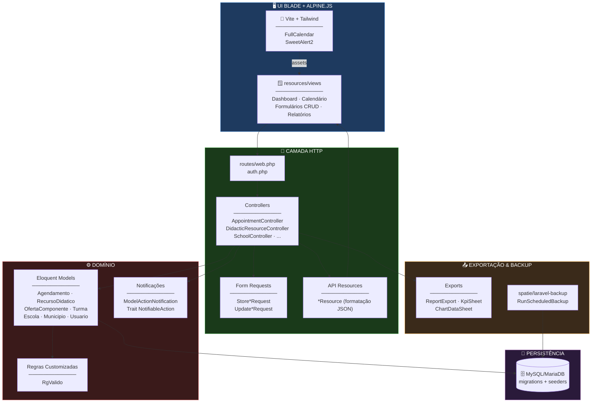
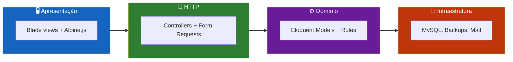
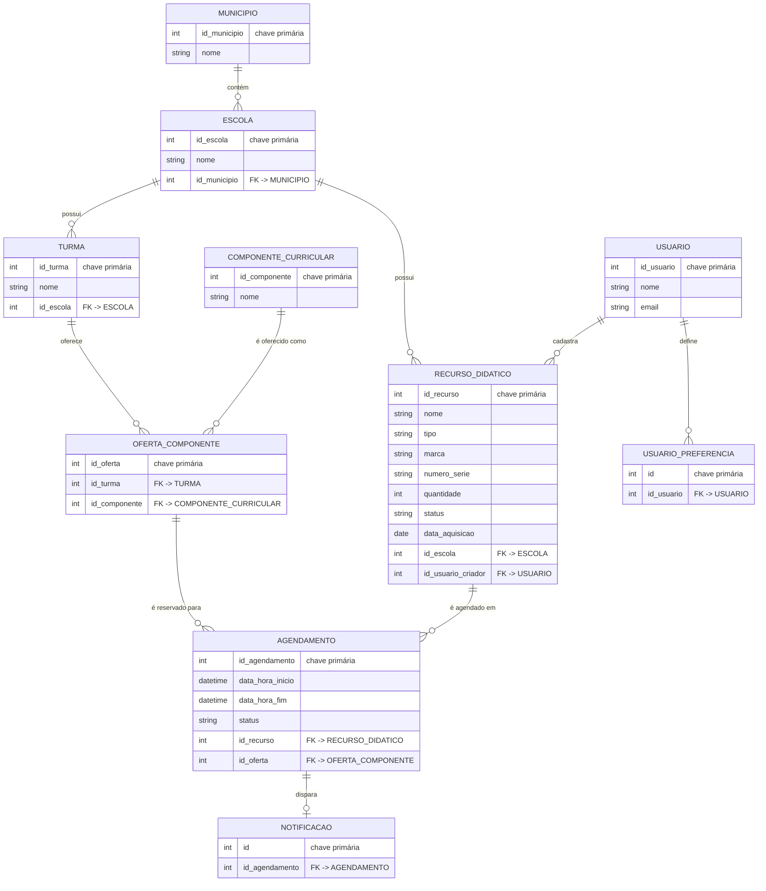
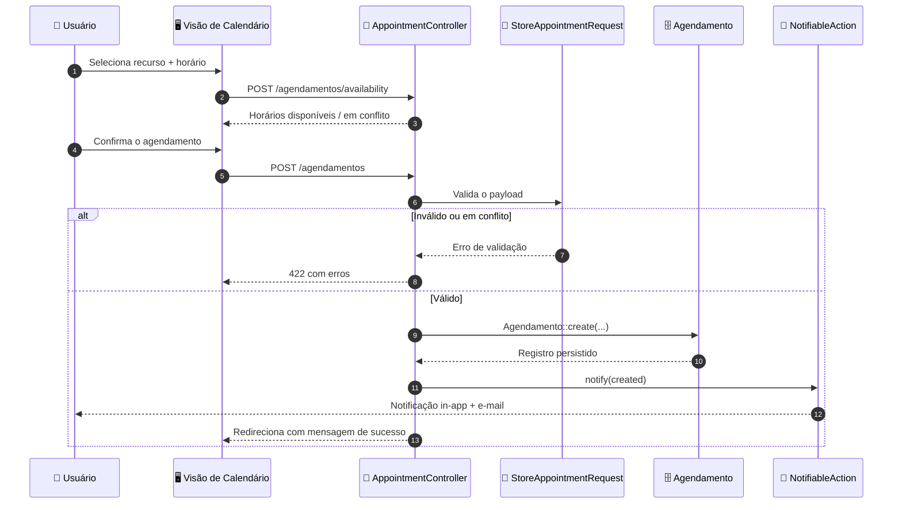
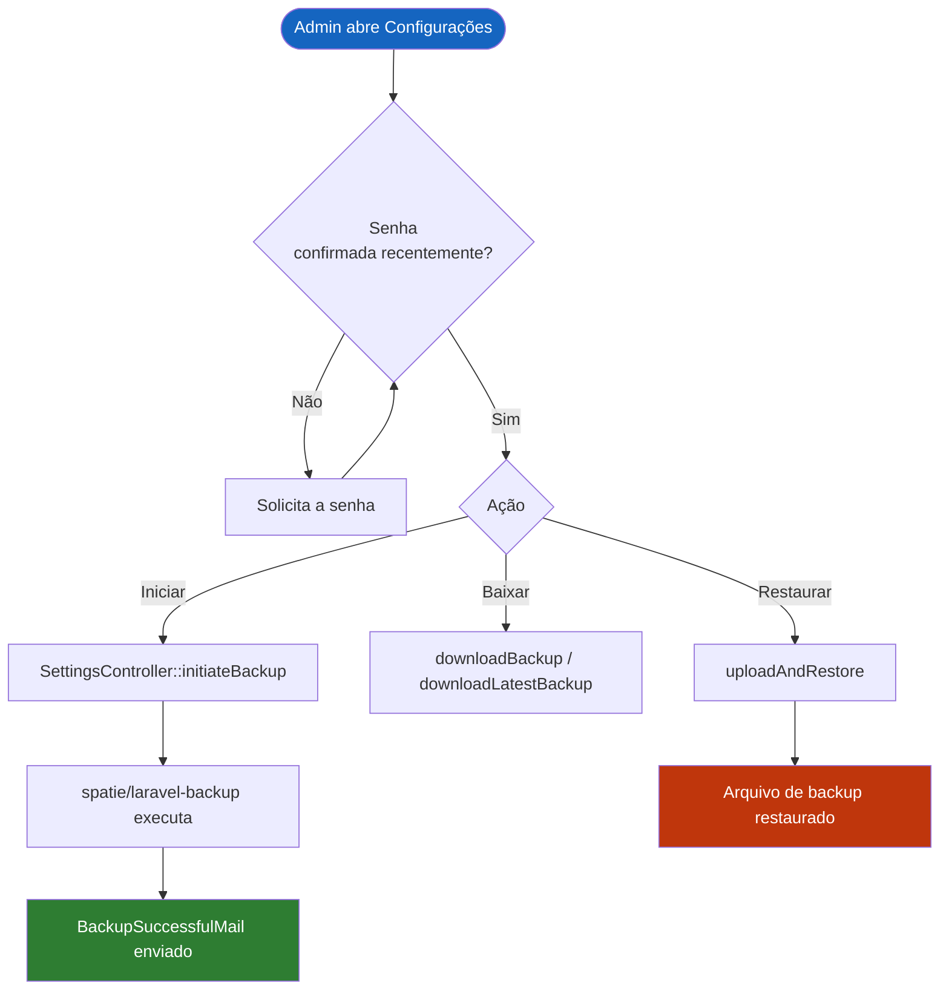
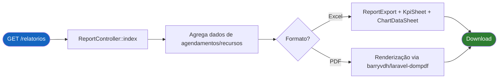
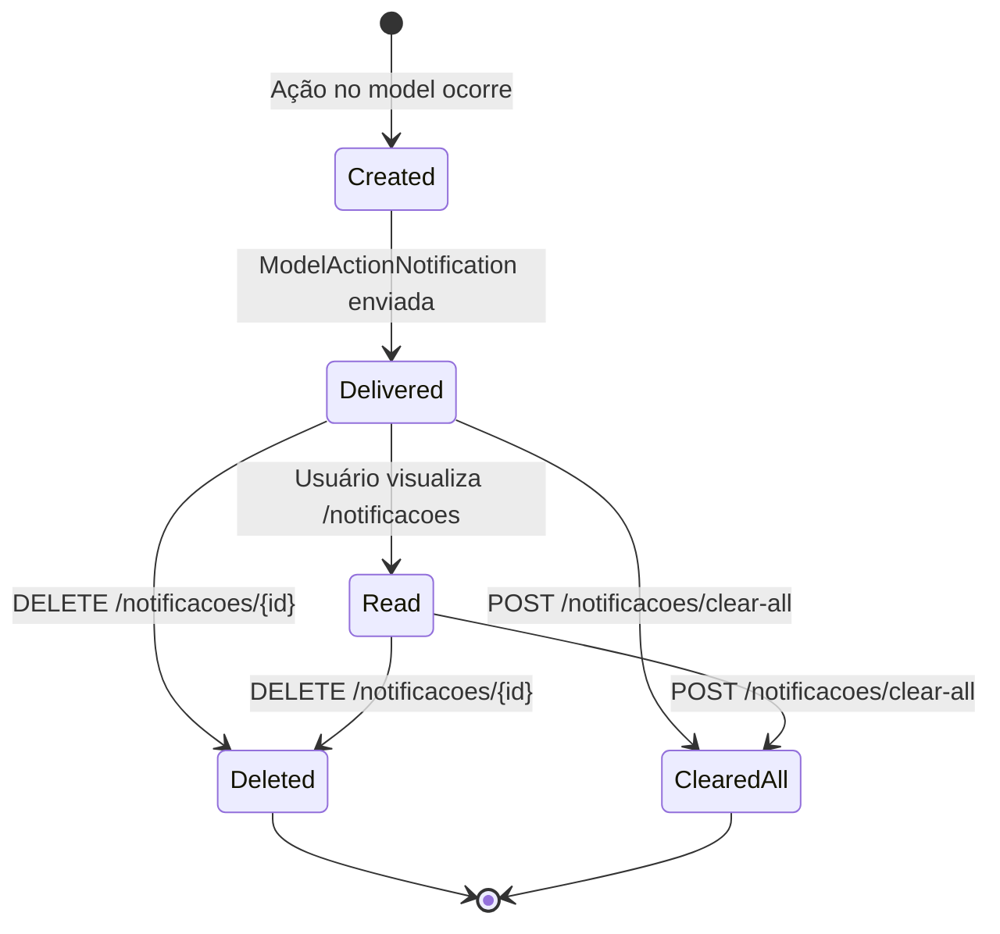
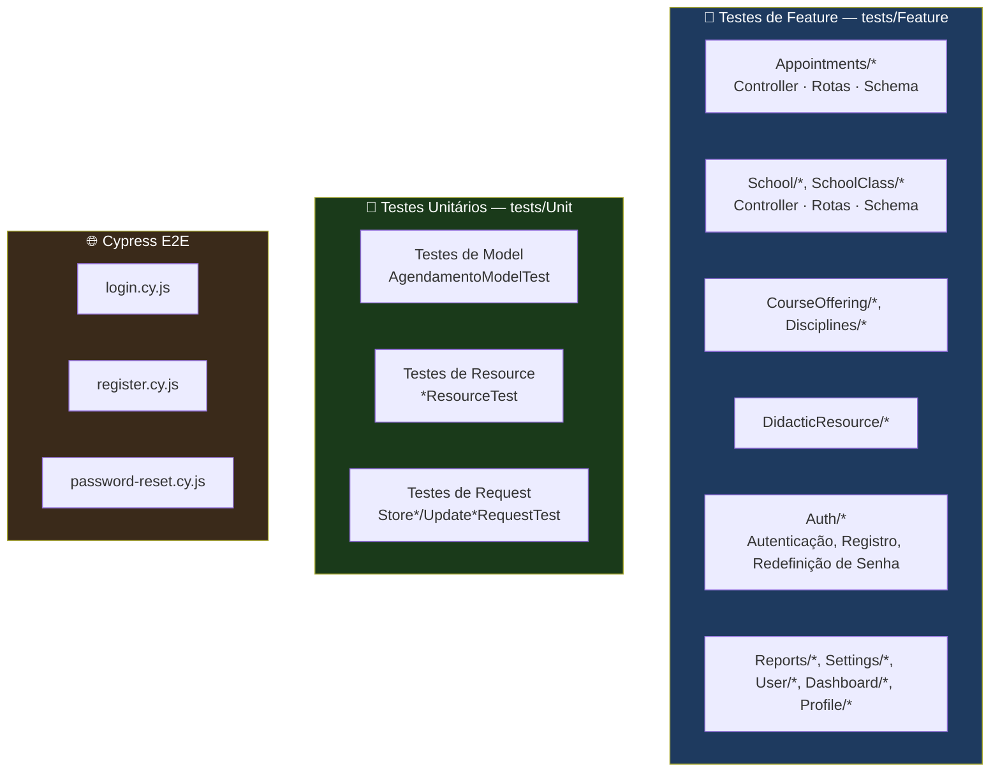

<div align="center">

**🌐 Choose Language / Selecione o Idioma / Elija el Idioma**

[](README.md)&nbsp;&nbsp;&nbsp;[](README_PT.md)&nbsp;&nbsp;&nbsp;[](README_ES.md)

</div>

---

<div align="center">

```
███╗   ██╗██████╗ ███████╗██████╗ ██╗   ██╗████████╗███████╗ ██████╗██╗  ██╗
████╗  ██║██╔══██╗██╔════╝██╔══██╗██║   ██║╚══██╔══╝██╔════╝██╔════╝██║  ██║
██╔██╗ ██║██████╔╝█████╗  ██║  ██║██║   ██║   ██║   █████╗  ██║     ███████║
██║╚██╗██║██╔══██╗██╔══╝  ██║  ██║██║   ██║   ██║   ██╔══╝  ██║     ██╔══██║
██║ ╚████║██║  ██║███████╗██████╔╝╚██████╔╝   ██║   ███████╗╚██████╗██║  ██║
╚═╝  ╚═══╝╚═╝  ╚═╝╚══════╝╚═════╝  ╚═════╝    ╚═╝   ╚══════╝ ╚═════╝╚═╝  ╚═╝
        Plataforma de agendamento e relatórios de recursos escolares (Laravel 12)
```

---

[](https://www.php.net/)
[](https://laravel.com/)
[](https://vitejs.dev/)
[](https://tailwindcss.com/)
[](https://www.cypress.io/)
[](https://phpunit.de/)
[]()

<br/>

> **Uma plataforma Laravel que agenda recursos didáticos em uma rede de escolas**
> e gera relatórios de uso, disponibilidade e conflitos.

<br/>


</div>

---

## 📑 Índice

<details>
<summary>▶️ <strong>Clique para expandir / recolher esta seção</strong></summary>

<table>
<tr>
<td valign="top" width="50%">

**🏗️ Sistema**
- [Visão Geral](#-visão-geral)
- [Arquitetura do Sistema](#-arquitetura-do-sistema)
- [Stack Tecnológica](#-stack-tecnológica)
- [Padrões de Projeto](#-padrões-de-projeto-aplicados)
- [Estrutura do Projeto](#-estrutura-do-projeto)

**📦 Módulos**
- [Módulos do Sistema](#-módulos-do-sistema)

</td>
<td valign="top" width="50%">

**💼 Negócio**
- [Regras de Negócio](#-regras-de-negócio)
- [Requisitos Funcionais](#-requisitos-funcionais)
- [Requisitos Não Funcionais](#-requisitos-não-funcionais)

**📐 Design**
- [Modelo de Dados](#-modelo-de-dados)
- [Fluxos do Sistema](#-fluxos-do-sistema)

**🔐 Segurança & Operações**
- [Segurança](#-segurança)
- [Instalação & Execução](#-instalação--execução)
- [Testes Automatizados](#-testes-automatizados)
- [Métricas & Monitoramento](#-métricas--monitoramento)
- [Limitações Conhecidas](#-limitações-conhecidas)

</td>
</tr>
</table>

---

</details>

## 🌟 Visão Geral

<details>
<summary>▶️ <strong>Clique para expandir / recolher esta seção</strong></summary>

O **nredutech** é uma aplicação web Laravel 12 que gerencia a alocação de **recursos didáticos** (laboratórios, equipamentos, salas) em uma rede de escolas pertencentes a municípios (`Municipio` / `Escola`). O sistema gira em torno de `Agendamento`: uma reserva de um `RecursoDidatico` (Recurso Didático) para uma `OfertaComponente` (Oferta de Componente), que vincula uma `Turma` a um `ComponenteCurricular` (Componente Curricular).

O sistema aplica regras de disponibilidade para que duas ofertas de componente não possam reservar em duplicidade o mesmo recurso em uma janela de tempo sobreposta, apresenta uma visão de calendário das reservas, envia notificações sobre eventos de agendamento e produz relatórios exportáveis (Excel via `maatwebsite/excel`, PDF via `barryvdh/laravel-dompdf`) com gráficos e KPIs. Administradores podem disparar e restaurar backups criptografados por meio do `spatie/laravel-backup`.

O frontend é renderizado no servidor com Blade e Tailwind CSS, Alpine.js para interatividade, FullCalendar para o calendário de agendamentos e SweetAlert2 para confirmações.

### 🎯 Objetivos do Sistema

| Objetivo | Descrição |
|-----------|-------------|
| 📅 **Agendamento de recursos** | Permitir que a equipe agende um recurso didático para uma oferta de componente e janela de tempo específicas |
| 🚫 **Prevenção de conflitos** | Rejeitar ou sinalizar agendamentos que se sobreponham a um recurso já reservado |
| 🏫 **Gestão da rede escolar** | Modelar municípios, escolas, turmas e componentes curriculares |
| 🔔 **Notificações** | Notificar usuários sobre criação, atualização e cancelamento de agendamentos |
| 📊 **Relatórios** | Gerar relatórios Excel/PDF com KPIs e gráficos sobre o uso dos recursos |
| 👤 **Acesso baseado em papéis** | Restringir a gestão de escolas e municípios a usuários `administrador` |
| 💾 **Backups** | Agendar, baixar e restaurar backups criptografados da aplicação |
| 🌐 **Localização** | Servir a interface e as mensagens de validação em Português do Brasil por padrão |

---

</details>

## 🏗️ Arquitetura do Sistema

<details>
<summary>▶️ <strong>Clique para expandir / recolher esta seção</strong></summary>

### Diagrama de Módulos



### Camadas da Arquitetura



---

</details>

## 🛠️ Stack Tecnológica

<details>
<summary>▶️ <strong>Clique para expandir / recolher esta seção</strong></summary>

<table>
<thead>
<tr>
<th>Camada</th>
<th>Tecnologia</th>
<th>Versão</th>
<th>Finalidade</th>
</tr>
</thead>
<tbody>
<tr>
<td rowspan="2"><strong>🧠 Linguagem / Runtime</strong></td>
<td>PHP</td>
<td>^8.3</td>
<td>Linguagem da aplicação</td>
</tr>
<tr>
<td>Composer</td>
<td>—</td>
<td>Gerenciamento de dependências (<code>composer.json</code>)</td>
</tr>
<tr>
<td rowspan="3"><strong>🖥️ Framework Backend</strong></td>
<td>Laravel</td>
<td>^12.0</td>
<td>Framework MVC, roteamento, Eloquent ORM</td>
</tr>
<tr>
<td>Laravel Breeze</td>
<td>^2.0</td>
<td>Estrutura inicial de autenticação</td>
</tr>
<tr>
<td>Laravel Tinker</td>
<td>^2.10</td>
<td>REPL para depuração/seeding</td>
</tr>
<tr>
<td rowspan="4"><strong>🎨 Frontend</strong></td>
<td>Vite</td>
<td>^7.0.4</td>
<td>Empacotamento de assets</td>
</tr>
<tr>
<td>Tailwind CSS</td>
<td>^3.1.0</td>
<td>Estilização utility-first</td>
</tr>
<tr>
<td>Alpine.js</td>
<td>^3.4.2</td>
<td>Interatividade leve na página</td>
</tr>
<tr>
<td>FullCalendar (core, daygrid, timegrid, list, interaction, resource-timeline)</td>
<td>^6.1.19</td>
<td>Interface de calendário de agendamentos</td>
</tr>
<tr>
<td rowspan="4"><strong>📦 Pacotes da Aplicação</strong></td>
<td>maatwebsite/excel</td>
<td>^3.1</td>
<td>Geração de relatórios Excel (planilhas de KPI e gráficos)</td>
</tr>
<tr>
<td>barryvdh/laravel-dompdf</td>
<td>^3.0.0-beta2</td>
<td>Geração de relatórios em PDF</td>
</tr>
<tr>
<td>spatie/laravel-backup</td>
<td>^9.3</td>
<td>Backups criptografados agendados/sob demanda</td>
</tr>
<tr>
<td>laravel-lang/lang + laravellegends/pt-br-validator</td>
<td>^15.0 / dev-master</td>
<td>Traduções e mensagens de validação em Português do Brasil</td>
</tr>
<tr>
<td rowspan="3"><strong>🧪 Testes</strong></td>
<td>PHPUnit</td>
<td>^11.0</td>
<td>Executor de testes de feature e unitários</td>
</tr>
<tr>
<td>Mockery</td>
<td>^1.6</td>
<td>Dublês de teste (test doubles)</td>
</tr>
<tr>
<td>Cypress</td>
<td>^15.6.0</td>
<td>Testes de ponta a ponta no navegador (fluxos de autenticação)</td>
</tr>
<tr>
<td rowspan="2"><strong>🔧 Ferramentas de Desenvolvimento</strong></td>
<td>Laravel Pint</td>
<td>^1.13</td>
<td>Corretor de estilo de código (PSR-12)</td>
</tr>
<tr>
<td>Laravel Sail / Pail</td>
<td>^1.26 / ^1.2</td>
<td>Ambiente Docker de desenvolvimento / acompanhamento de logs</td>
</tr>
</tbody>
</table>

---

</details>

## 🎨 Padrões de Projeto Aplicados

<details>
<summary>▶️ <strong>Clique para expandir / recolher esta seção</strong></summary>

| Padrão | Onde | Justificativa |
|---------|-------|-----------|
| 🧱 **MVC** | `app/Http/Controllers`, `app/Models`, `resources/views` | Separação de responsabilidades padrão do Laravel |
| 📝 **Validação via Form Request** | `app/Http/Requests/Store*Request.php`, `Update*Request.php` | Validação e autorização ficam fora do corpo do controller |
| 🎁 **Resource / DTO** | `app/Http/Resources/*Resource.php` | Formata os models Eloquent em um JSON consistente para o calendário/consumidores de API |
| 🧩 **Composição via Trait** | `app/Traits/NotifiableAction.php` | Comportamento compartilhado de disparo de notificações reutilizado em vários controllers |
| 🔌 **Active Record** | Models Eloquent (`Agendamento`, `RecursoDidatico`, ...) | Cada model é responsável por seus próprios relacionamentos e mapeamento de tabela |
| 🧪 **Regra de Validação Customizada** | `app/Rules/RgValido.php` | Validação de documento específica do domínio (RG brasileiro) encapsulada como um objeto de regra |
| 📤 **Estratégia de Exportação** | `app/Exports/*.php` (`ReportExport`, `KpiSheet`, `ChartDataSheet`) | Cada responsabilidade de exportação implementada como sua própria classe de planilha do `maatwebsite/excel` |
| ⏰ **Comando Agendado** | `app/Console/Commands/RunScheduledBackup.php` | Lógica de backup isolada em um comando Artisan, integrado ao scheduler |
| 🔔 **Notificação estilo Observer** | `app/Notifications/ModelActionNotification.php` | Notificação genérica disparada após ações de criação/atualização/exclusão de model |

---

</details>

## 📁 Estrutura do Projeto

<details>
<summary>▶️ <strong>Clique para expandir / recolher esta seção</strong></summary>

```
nredutech/
│
├── 📄 composer.json                     # Dependências PHP (Laravel 12, PHP ^8.3)
├── 📄 package.json                      # Dependências JS (Vite, Tailwind, FullCalendar)
├── 📄 phpunit.xml                       # Configuração da suíte PHPUnit
├── 📄 vite.config.js                    # Configuração de build do Vite
├── 📄 tailwind.config.js                # Configuração de tema do Tailwind
├── 📄 cypress.config.js                 # Configuração do Cypress E2E
├── 📄 artisan                           # Ponto de entrada da CLI do Laravel
│
├── 📂 app/
│   ├── 📂 Console/Commands/             # RunScheduledBackup.php
│   ├── 📂 Exports/                      # ReportExport, KpiSheet, ChartDataSheet, AllReportsExport
│   ├── 📂 Http/
│   │   ├── 📂 Controllers/              # 14 controllers (Appointment, School, User, Report, ...)
│   │   ├── 📂 Requests/                 # Classes Store*/Update* de form request
│   │   └── 📂 Resources/                # Transformadores JSON *Resource.php
│   ├── 📂 Mail/                         # BackupSuccessfulMail, CustomResetPasswordMail, NotificationMail
│   ├── 📂 Models/                       # Agendamento, RecursoDidatico, Escola, Municipio, ...
│   ├── 📂 Notifications/                # ModelActionNotification, CustomBackupWasSuccessfulNotification
│   ├── 📂 Providers/                    # Service providers de App/Auth/Event/Route
│   ├── 📂 Rules/                        # RgValido.php
│   ├── 📂 Traits/                       # NotifiableAction.php
│   └── 📂 View/Components/              # AppLayout, GuestLayout
│
├── 📂 database/
│   ├── 📂 migrations/                   # Histórico do schema (nomes de tabelas/colunas em português)
│   ├── 📂 factories/                    # Factories de model para testes/seeding
│   └── 📂 seeders/                      # Seeders de dados de referência/demonstração
│
├── 📂 routes/
│   ├── web.php                          # Rotas autenticadas da aplicação (resource controllers)
│   └── auth.php                         # Rotas de autenticação do Breeze
│
├── 📂 resources/
│   ├── 📂 views/                        # Templates Blade (dashboard, CRUD, calendário, relatórios)
│   ├── 📂 css/ · 📂 js/                 # Entrada do Tailwind + integração Alpine/FullCalendar
│   └── 📂 lang/                         # Strings de tradução pt_BR
│
├── 📂 tests/
│   ├── 📂 Feature/                      # Testes de controller/rota/schema por módulo
│   └── 📂 Unit/                         # Testes unitários de Model, Request e Resource
│
├── 📂 cypress/
│   └── 📂 e2e/                          # login.cy.js, register.cy.js, password-reset.cy.js
│
├── 📄 README.md                         # 🇺🇸 Inglês (principal)
├── 📄 README_PT.md                      # 🇧🇷 Português
└── 📄 README_ES.md                      # 🇪🇸 Español
```

---

</details>

## 📦 Módulos do Sistema

<details>
<summary>▶️ <strong>Clique para expandir / recolher esta seção</strong></summary>

### 📅 Agendamento (`Agendamento`)

O `AppointmentController` é o núcleo do sistema: lista um feed pronto para o FullCalendar (`getCalendarEvents`), verifica horários livres para um recurso em uma data específica (`getAvailabilityForDate`) e expõe o CRUD padrão via `Route::resource('agendamentos', ...)`.

| Responsabilidade | Implementação |
|-----------------|-----------------|
| Feed de calendário | `GET /agendamentos/events` → `AppointmentController::getCalendarEvents` |
| Verificação de disponibilidade | `POST /agendamentos/availability` → `getAvailabilityForDate` |
| CRUD | `Route::resource('agendamentos', AppointmentController::class)` |
| Validação | `StoreAppointmentRequest`, `UpdateAppointmentRequest` |
| Formatação JSON | `AppointmentResource` |
| Campos do model | `data_hora_inicio`, `data_hora_fim`, `status`, `id_recurso`, `id_oferta` |
| Relacionamentos | `belongsTo RecursoDidatico`, `belongsTo OfertaComponente`, `hasOne Notificacao` |

---

### 🧰 Recursos Didáticos (`RecursoDidatico`)

Representa um ativo reservável (equipamento de laboratório, projetor, sala, etc.) pertencente a uma escola.

| Campo | Finalidade |
|-------|---------|
| `nome`, `tipo`, `marca`, `numero_serie` | Dados de identificação e inventário |
| `quantidade` | Unidades disponíveis |
| `status` | Estado atual de disponibilidade/condição |
| `data_aquisicao` | Data de aquisição |
| `id_escola` | Escola proprietária (`belongsTo Escola`) |
| `id_usuario_criador` | Criador (`belongsTo Usuario`) |
| `agendamentos()` | `hasMany Agendamento` — histórico completo de reservas |

---

### 🏫 Rede Escolar (`Escola`, `Municipio`, `Turma`)

Modela a hierarquia organizacional: um `Municipio` contém `Escola` (Escolas), cada uma com `Turma` (Turmas). A gestão de `escolas` e `municipios` é restrita a usuários `administrador` via `Route::middleware(['can:administrador'])`.

| Controller | Prefixo de rota | Acesso |
|------------|--------------|--------|
| `SchoolController` | `/escolas` | Apenas `can:administrador` |
| `CityController` | `/municipios` | Apenas `can:administrador` |
| `SchoolClassController` | `/turmas` | Qualquer usuário autenticado |

---

### 📚 Currículo (`ComponenteCurricular`, `OfertaComponente`)

O `ComponenteCurricular` (ex.: uma disciplina) é oferecido em uma `Turma` específica por meio de `OfertaComponente` (Oferta de Componente) — a entidade contra a qual um `Agendamento` de fato reserva tempo.

| Controller | Prefixo de rota | Alias do parâmetro de rota |
|------------|--------------|------------------------|
| `CurricularComponentController` | `/componentes` | `componente` |
| `CourseOfferingController` | `/ofertas` | `ofertaComponente` |

---

### 👤 Usuários & Perfil

| Controller | Responsabilidade |
|------------|-----------------|
| `UserController` | CRUD administrativo sobre `Usuario` |
| `ProfileController` | Edição/exclusão de autoatendimento do perfil do usuário logado |
| `UserPreferenceController` | Persiste preferências de interface por usuário (`UsuarioPreferencia`) |

---

### 🔔 Notificações

| Arquivo | Responsabilidade |
|------|-----------------|
| `NotificationController` | Lista, exclui e limpa em massa as notificações in-app |
| `app/Notifications/ModelActionNotification.php` | Notificação genérica de "uma ação ocorreu em um model" |
| `app/Traits/NotifiableAction.php` | Reutilizada em controllers para disparar notificações após criação/atualização/exclusão |
| `app/Mail/NotificationMail.php` | Transporte de e-mail para notificações |

---

### 📊 Relatórios & Exportações

| Arquivo | Responsabilidade |
|------|-----------------|
| `ReportController` | Serve `/relatorios` e monta os dados do relatório |
| `app/Exports/ReportExport.php`, `SingleReportSheet.php`, `AllReportsExport.php` | Composição da planilha Excel (`maatwebsite/excel`) |
| `app/Exports/KpiSheet.php`, `ChartDataSheet.php` | Planilhas de KPI e dados de gráfico embutidas no workbook exportado |
| Caminho PDF | `barryvdh/laravel-dompdf` renderiza os mesmos dados do relatório em PDF |

---

### 💾 Configurações & Backup

| Rota | Acesso | Responsabilidade |
|-------|--------|-----------------|
| `PATCH /configuracoes/preferences` | Qualquer usuário | Atualiza preferências de interface |
| `PATCH /configuracoes/backup/schedule` | `administrador` | Atualiza o agendamento de backup |
| `GET /configuracoes/backup/initiate` | `administrador` + `password.confirm` | Dispara um backup sob demanda |
| `GET /configuracoes/backup/download/{filename}` | `administrador` + `password.confirm` | Baixa um arquivo de backup específico |
| `POST /configuracoes/backup/restore-upload` | `administrador` + `password.confirm` | Envia e restaura um backup |
| `app/Console/Commands/RunScheduledBackup.php` | Scheduler | Executa o `spatie/laravel-backup` em uma agenda |

---

</details>

## 💼 Regras de Negócio

<details>
<summary>▶️ <strong>Clique para expandir / recolher esta seção</strong></summary>

### 📅 Regras de Agendamento

| # | Regra | Aplicação |
|---|------|-------------|
| RN-01 | Um recurso não pode ser reservado em duplicidade em uma janela de tempo sobreposta | Verificação de disponibilidade em `AppointmentController::getAvailabilityForDate` / validada no armazenamento |
| RN-02 | Um agendamento deve referenciar um recurso e uma oferta de componente existentes | Chaves estrangeiras `id_recurso`, `id_oferta` + validação em `StoreAppointmentRequest` |
| RN-03 | Um agendamento carrega um `status` que reflete seu ciclo de vida | Coluna `status` em `agendamentos`, coberta por `AppointmentDatabaseSchemaTest` |

### 🏫 Regras Organizacionais

| # | Regra | Aplicação |
|---|------|-------------|
| RN-04 | Somente usuários `administrador` podem gerenciar escolas e municípios | `Route::middleware(['can:administrador'])` em torno de `escolas` / `municipios` |
| RN-05 | Operações sensíveis de backup exigem reconfirmação de senha | `Route::middleware(['password.confirm'])` em iniciar/baixar/restaurar |
| RN-06 | Um recurso didático pertence a exatamente uma escola | Chave estrangeira `id_escola` em `recursos_didaticos`, não nula |

### 🔔 Regras de Notificação

| # | Regra | Aplicação |
|---|------|-------------|
| RN-07 | Ações relevantes em models geram uma notificação in-app | Trait `NotifiableAction` invocada a partir dos controllers |
| RN-08 | Usuários podem limpar todas as suas notificações de uma vez | `POST /notificacoes/clear-all` → `NotificationController::clearAll` |

---

</details>

## ✅ Requisitos Funcionais

<details>
<summary>▶️ <strong>Clique para expandir / recolher esta seção</strong></summary>

| ID | Requisito | Prioridade | Status |
|----|-------------|----------|--------|
| **RF-01** | O sistema deve permitir que usuários autenticados se registrem e façam login | 🔴 Alta | ✅ Implementado |
| **RF-02** | O sistema deve apresentar um dashboard resumindo as principais atividades | 🔴 Alta | ✅ Implementado |
| **RF-03** | O sistema deve permitir criar, visualizar, atualizar e excluir agendamentos | 🔴 Alta | ✅ Implementado |
| **RF-04** | O sistema deve expor os agendamentos como um feed compatível com FullCalendar | 🔴 Alta | ✅ Implementado |
| **RF-05** | O sistema deve verificar a disponibilidade do recurso antes de confirmar uma reserva | 🔴 Alta | ✅ Implementado |
| **RF-06** | O sistema deve gerenciar recursos didáticos com metadados de inventário | 🔴 Alta | ✅ Implementado |
| **RF-07** | O sistema deve gerenciar componentes curriculares e ofertas de componente | 🟡 Média | ✅ Implementado |
| **RF-08** | O sistema deve gerenciar turmas escolares | 🟡 Média | ✅ Implementado |
| **RF-09** | O sistema deve restringir a gestão de escolas e municípios a administradores | 🔴 Alta | ✅ Implementado |
| **RF-10** | O sistema deve gerenciar os usuários da aplicação | 🟡 Média | ✅ Implementado |
| **RF-11** | O sistema deve permitir que um usuário edite ou exclua o próprio perfil | 🟡 Média | ✅ Implementado |
| **RF-12** | O sistema deve persistir preferências por usuário | 🟢 Baixa | ✅ Implementado |
| **RF-13** | O sistema deve listar e permitir o gerenciamento de notificações | 🟡 Média | ✅ Implementado |
| **RF-14** | O sistema deve gerar relatórios Excel com KPIs e gráficos | 🟡 Média | ✅ Implementado |
| **RF-15** | O sistema deve gerar relatórios em PDF | 🟡 Média | ✅ Implementado |
| **RF-16** | O sistema deve permitir que administradores agendem backups automáticos | 🟡 Média | ✅ Implementado |
| **RF-17** | O sistema deve permitir que administradores baixem e restaurem backups | 🟡 Média | ✅ Implementado |
| **RF-18** | O sistema deve exigir reconfirmação de senha para ações sensíveis de backup | 🔴 Alta | ✅ Implementado |
| **RF-19** | O sistema deve validar números de documento brasileiro (RG) por meio de uma regra customizada | 🟢 Baixa | ✅ Implementado |
| **RF-20** | O sistema deve servir a interface em Português do Brasil | 🟡 Média | ✅ Implementado |
| **RF-21** | O sistema deve enviar notificações por e-mail para eventos relevantes | 🟢 Baixa | ✅ Implementado |
| **RF-22** | O sistema deve cobrir os fluxos de autenticação com testes E2E via Cypress | 🟡 Média | ✅ Implementado |

---

</details>

## ⚡ Requisitos Não Funcionais

<details>
<summary>▶️ <strong>Clique para expandir / recolher esta seção</strong></summary>

| ID | Categoria | Requisito | Alvo |
|----|----------|-------------|--------|
| **RNF-01** | 🔐 Segurança | Proteção CSRF em todas as requisições que alteram estado | Middleware `VerifyCsrfToken` |
| **RNF-02** | 🔐 Segurança | Senhas com hash pelo hasher padrão do Laravel | Facade `Hash` do Laravel (bcrypt) |
| **RNF-03** | 🔐 Controle de Acesso | Rotas exclusivas de administrador protegidas por Gate/Policy do Laravel | Middleware `can:administrador` |
| **RNF-04** | 🔐 Segurança | Downloads/restaurações de backup exigem confirmação de senha recente | Middleware `password.confirm` |
| **RNF-05** | 🧪 Testabilidade | Todo módulo principal tem testes de controller, rota e schema | `tests/Feature/<Módulo>/*Test.php` |
| **RNF-06** | 🧪 Testabilidade | Fluxos críticos de autenticação cobertos ponta a ponta | `cypress/e2e/*.cy.js` |
| **RNF-07** | 🌍 Localização | Interface e mensagens de validação em pt-BR por padrão | `laravel-lang/lang`, `pt-br-validator` |
| **RNF-08** | 🧱 Manutenibilidade | Estilo de código aplicado automaticamente | Laravel Pint (PSR-12) |
| **RNF-09** | 💾 Confiabilidade | Estado da aplicação recuperável via backups | `spatie/laravel-backup` |
| **RNF-10** | 📈 Observabilidade | Resultados de backup reportados por e-mail | `BackupSuccessfulMail`, `CustomBackupWasSuccessfulNotification` |
| **RNF-11** | ⚡ Desempenho | Assets de frontend empacotados e minificados para produção | `vite build` |
| **RNF-12** | 📱 Usabilidade | Visão de calendário suporta layouts de dia/semana/lista/linha do tempo de recursos | Conjunto de plugins do FullCalendar em `package.json` |
| **RNF-13** | 🔧 Portabilidade | Ambiente local dockerizado disponível | Dependência de desenvolvimento Laravel Sail |

---

</details>

## 🗄️ Modelo de Dados

<details>
<summary>▶️ <strong>Clique para expandir / recolher esta seção</strong></summary>

### Diagrama Entidade-Relacionamento



### Colunas Principais das Tabelas

| Tabela | Chave Primária | Colunas Relevantes |
|-------|-------------|------------------|
| `agendamentos` | `id_agendamento` | `data_hora_inicio`, `data_hora_fim`, `status`, `id_recurso`, `id_oferta` |
| `recursos_didaticos` | `id_recurso` | `nome`, `tipo`, `marca`, `numero_serie`, `quantidade`, `status`, `data_aquisicao`, `id_escola`, `id_usuario_criador` |
| `escolas` | `id_escola` | `nome`, `id_municipio` |
| `municipios` | `id_municipio` | `nome` |

### Migração & Seeding

| Item | Arquivo(s) |
|---------|---------|
| Histórico do schema | `database/migrations/*.php` |
| Dados de referência/demonstração | `database/seeders/*.php` |
| Geração de dados de teste | `database/factories/*.php` |

---

</details>

## 🔄 Fluxos do Sistema

<details>
<summary>▶️ <strong>Clique para expandir / recolher esta seção</strong></summary>

### Fluxo de Criação de Agendamento



### Fluxo de Backup & Restauração



### Fluxo de Geração de Relatórios



### Ciclo de Vida da Notificação



---

</details>

## 🔐 Segurança

<details>
<summary>▶️ <strong>Clique para expandir / recolher esta seção</strong></summary>

### Controles Implementados

| Controle | Implementação | Efeito |
|---------|---------------|--------|
| 🔐 **Autenticação** | Laravel Breeze (rotas em `auth.php`) | Login, registro e redefinição de senha baseados em sessão |
| 🛡️ **Proteção CSRF** | Middleware `VerifyCsrfToken` | Rejeita requisições que alteram estado sem um token válido |
| 🔑 **Reconfirmação de senha** | Middleware `password.confirm` nas rotas de backup | Ações de alto impacto exigem uma verificação de senha recente |
| 🚦 **Controle por papel** | Middleware `can:administrador` | Somente administradores acessam a gestão de escolas/municípios/backup |
| 🧾 **Validação no servidor** | Classes `Store*Request` / `Update*Request` | Todo caminho de escrita é validado antes de tocar o banco de dados |
| 🧬 **Validação de documento customizada** | `app/Rules/RgValido.php` | Rejeita números de RG brasileiro malformados |
| 💾 **Backups criptografados** | `spatie/laravel-backup` | O estado da aplicação pode ser recuperado sem expor arquivos em texto claro, se a criptografia estiver configurada |
| 📧 **Redefinição de senha via e-mail assinado** | `CustomResetPasswordMail` | Links de redefinição são limitados no tempo e assinados |

### Limitações de Segurança Conhecidas

> [!WARNING]
> Os itens a seguir são inerentes ao design atual e devem ser compreendidos antes de um uso em produção mais amplo.

| Limitação | Risco | Caminho de mitigação |
|------------|------|-----------------|
| 🗄️ **Chaves primárias usam nomes em português, específicos por tabela** (`id_agendamento`, `id_recurso`) | Aumenta o acoplamento entre SQL bruto/relatórios e a nomenclatura do schema | Aceitável para uma base de código de equipe única; documentar caso o schema seja exposto externamente |
| 🔓 **Sem rate limiting visível nas rotas de autenticação em `web.php`** | Risco de força bruta em login/registro | Adicionar o middleware `throttle` nativo do Laravel às rotas de `auth.php`, caso ainda não herdado dos padrões do Breeze |
| 📤 **Exportações de relatório podem incluir dados pessoalmente identificáveis** | Relatórios Excel/PDF podem vazar dados de alunos/funcionários se compartilhados amplamente | Restringir o acesso a relatórios a `administrador` e auditar a autorização em `ReportController::index` |
| 🔁 **A restauração de backup aceita um arquivo enviado** | Um arquivo malicioso poderia ser enviado por uma conta de administrador comprometida | Combinar com boas práticas de higiene de conta de admin (2FA não está implementado atualmente) |
| 🌍 **Sem 2FA** | Risco de tomada de conta caso uma senha vaze | Adicionar Laravel Fortify ou suporte similar a dois fatores |

---

</details>

## 🚀 Instalação & Execução

<details>
<summary>▶️ <strong>Clique para expandir / recolher esta seção</strong></summary>

### Pré-requisitos

```bash
# PHP 8.3+ com extensões comuns (pdo_mysql, mbstring, xml, ...)
php -v

# Composer
composer -V

# Node.js 18+ e npm
node -v

# Um banco de dados MySQL/MariaDB (ou o contêiner incluso no Laravel Sail)
```

### Build

```bash
# Instalar dependências PHP
composer install

# Instalar dependências JS
npm install

# Copiar o arquivo de ambiente e gerar a chave da aplicação
cp .env.example .env
php artisan key:generate

# Configurar as variáveis DB_* no .env, depois rodar migrations + seeders
php artisan migrate --seed

# Compilar os assets de frontend para produção
npm run build
```

### Execução

```bash
# Desenvolvimento local (servidor de desenvolvimento do Laravel)
php artisan serve

# Desenvolvimento local (servidor de desenvolvimento do Vite com HMR, em um segundo terminal)
npm run dev

# Ou, com Laravel Sail (Docker)
./vendor/bin/sail up -d
./vendor/bin/sail artisan migrate --seed
```

### Scripts & Alvos

| Comando | Finalidade |
|---------|---------|
| `php artisan serve` | Executa o servidor de desenvolvimento PHP embutido |
| `npm run dev` | Inicia o servidor de desenvolvimento Vite com hot module reload |
| `npm run build` | Compila os assets de frontend para produção |
| `php artisan migrate --seed` | Aplica as migrations e popula os dados de referência |
| `php artisan backup:run` | Dispara manualmente um backup via `spatie/laravel-backup` |
| `php artisan schedule:run` | Executa os comandos agendados pendentes (ex.: `RunScheduledBackup`) |
| `./vendor/bin/pint` | Aplica as correções de estilo de código do Laravel Pint |

### Configuração de Ambiente

| Grupo de variáveis | Finalidade |
|-----------------|---------|
| `APP_*` | Nome, ambiente, modo debug e chave da aplicação |
| `DB_*` | Conexão com o banco de dados (MySQL/MariaDB) |
| `MAIL_*` | Configurações SMTP para e-mails de notificação e backup |
| `BACKUP_*` | Destino e configurações de criptografia de backup para o `spatie/laravel-backup` |

---

</details>

## 🧪 Testes Automatizados

<details>
<summary>▶️ <strong>Clique para expandir / recolher esta seção</strong></summary>

### Arquitetura de Testes



| Suíte | Localização | Foco |
|-------|----------|-------|
| Agendamentos | `tests/Feature/Appointments/` | Controller, rotas, schema do BD para `agendamentos` |
| Rede escolar | `tests/Feature/School/`, `tests/Feature/SchoolClass/` | Escolas, municípios, turmas |
| Currículo | `tests/Feature/CourseOffering/`, `tests/Feature/Disciplines/` | Ofertas de componente, componentes curriculares |
| Recursos didáticos | `tests/Feature/DidacticResource/` | Controller, rotas, schema |
| Autenticação | `tests/Feature/Auth/` | Autenticação, registro, redefinição de senha |
| Usuários & perfil | `tests/Feature/User/`, `tests/Feature/Profile/` | CRUD de usuários, notificações, autoatendimento de perfil |
| Relatórios & configurações | `tests/Feature/Reports/`, `tests/Feature/Settings/`, `tests/Feature/Dashboard/` | Geração de relatórios e rotas de configurações/backup |
| Unitários | `tests/Unit/` | Classes de Model, Resource e Request isoladamente |
| E2E | `cypress/e2e/` | Fluxos de sucesso de login, registro e redefinição de senha em um navegador real |

### Executando os Testes

```bash
# Suíte PHPUnit de feature + unitários
php artisan test
# ou
./vendor/bin/phpunit

# Cypress E2E (requer a aplicação em execução, ex. via `php artisan serve`)
npx cypress open      # interativo
npx cypress run       # headless
```

### Checklist de Aceitação Manual

| # | Cenário | Resultado esperado |
|---|----------|-----------------|
| 1 | Registrar e fazer login | Conta criada, redirecionado ao dashboard |
| 2 | Reservar um recurso em um horário disponível | Agendamento criado, calendário atualizado |
| 3 | Tentar reservar um horário já ocupado | Reserva rejeitada com mensagem de conflito |
| 4 | Usuário não-admin acessa `/escolas` | Acesso negado (403) |
| 5 | Admin cria uma escola e um município | Registros criados e listados |
| 6 | Gerar um relatório Excel | Arquivo baixado com planilhas de KPI e gráficos |
| 7 | Gerar um relatório em PDF | PDF baixado com os mesmos dados subjacentes |
| 8 | Disparar um backup manual como admin | Backup criado, e-mail de confirmação enviado |
| 9 | Limpar todas as notificações | Lista de notificações fica vazia |

---

</details>

## 📊 Métricas & Monitoramento

<details>
<summary>▶️ <strong>Clique para expandir / recolher esta seção</strong></summary>

### Métricas da Base de Código

| Métrica | Valor |
|--------|-------|
| Controllers | 14 |
| Models Eloquent | 9 |
| Classes Form Request | 20 |
| Classes API Resource | 8 |
| Classes de exportação | 5 |
| Diretórios de testes de feature | 10 módulos |
| Arquivos de testes unitários | 10+ (models, resources, requests) |
| Specs Cypress E2E | 3 |
| Classes de notificação | 2 |

### Sinais em Tempo de Execução

| Sinal | Origem | Onde observar |
|--------|--------|------------------|
| Sucesso/falha de backup | Eventos do `spatie/laravel-backup` | `BackupSuccessfulMail`, `CustomBackupWasSuccessfulNotification` |
| Execuções de jobs agendados | Scheduler do Laravel | `php artisan schedule:list`, saída de log |
| Erros da aplicação | Manipulador de exceções do Laravel | `storage/logs/laravel.log` |
| Logs em nível de requisição | `php artisan pail` | Acompanhamento de log em tempo real durante o desenvolvimento |

### Comandos Úteis de Diagnóstico

```bash
# Acompanhar os logs da aplicação em tempo real
php artisan pail

# Listar os comandos agendados e seus próximos horários de execução
php artisan schedule:list

# Verificar o status/destinos atuais de backup
php artisan backup:list

# Limpar config/rotas/views em cache após um deploy
php artisan optimize:clear
```

### Códigos de Resposta Padronizados

| Código | Significado | Onde |
|------|---------|-------|
| `200` | OK | Requisições GET bem-sucedidas |
| `302` | Redirecionamento | Redirecionamentos pós-criação/atualização com mensagens flash |
| `403` | Proibido | Rejeição pelo gate `can:administrador` |
| `404` | Não Encontrado | Vínculo de rota-model de recurso ausente |
| `422` | Entidade Não Processável | Falha de validação em Form Request |
| `500` | Erro Interno do Servidor | Exceção não tratada, registrada em `laravel.log` |

---

</details>

## ⚠️ Limitações Conhecidas

<details>
<summary>▶️ <strong>Clique para expandir / recolher esta seção</strong></summary>

> [!IMPORTANT]
> Este projeto foi construído para um caso de uso real de agendamento em rede de escolas; alguns itens de polimento abaixo são conhecidos e acompanhados, não lacunas acidentais.

| Categoria | Problema | Status |
|----------|-------|--------|
| 🌍 **Nomenclatura do banco de dados em português** | Nomes de tabelas/colunas (`agendamentos`, `id_recurso`) se misturam com nomes de classes em inglês | ➕ Intencional — condiz com o idioma nativo do domínio |
| 🔐 **Sem autenticação de dois fatores** | Apenas login de um único fator | ⚠️ Em aberto — considerar 2FA via Laravel Fortify |
| 🚦 **Sem rate limiting explícito visível nas rotas de autenticação** | Potencial exposição a força bruta | ⚠️ Em aberto — adicionar o middleware `throttle` explicitamente, caso não coberto pelos padrões do Breeze |
| 📊 **Desempenho de relatórios não avaliado** | Grandes volumes de dados podem tornar lenta a geração de Excel/PDF | ⚠️ Em aberto — adicionar geração de exportação em fila para intervalos de relatório grandes |
| 🧪 **Caso de teste Dusk presente, mas testes de navegador não confirmados no CI** | `tests/DuskTestCase.php` existe ao lado do Cypress | ⚠️ Em aberto — confirmar qual ferramenta E2E é a fonte da verdade daqui em diante |
| 🔁 **A verificação de disponibilidade e a validação de armazenamento podem divergir** | Dois caminhos de código (`getAvailabilityForDate` e a validação de armazenamento) precisam concordar sobre as regras de conflito | ⚠️ Em aberto — consolidar em um único método de serviço |
| 📧 **A entrega de e-mail depende de SMTP configurado corretamente** | Uma configuração incorreta descarta silenciosamente e-mails de notificação/backup | ⚠️ Em aberto — adicionar uma verificação de saúde de entrega de e-mail |
| 💾 **A criptografia de backup depende da configuração do `.env`** | Um backup não criptografado poderia ser criado se `BACKUP_*` estiver mal configurado | ⚠️ Em aberto — validar a configuração de backup na inicialização de `RunScheduledBackup` |

> [!TIP]
> A melhoria de maior valor isolada é consolidar a **verificação de disponibilidade e a validação de agendamento** em uma única classe de serviço, eliminando o risco de a visão "disponível" do calendário divergir do que o endpoint de armazenamento de fato aceita.

</details>

---

<div align="center">

---

### 🏫 nredutech

*Um recurso, um horário, sem reservas em duplicidade*


<br/>

```
"Um calendário escolar é uma promessa a cada sala de aula —
 a única função do sistema é manter essa promessa livre de conflitos."
```

</div>
